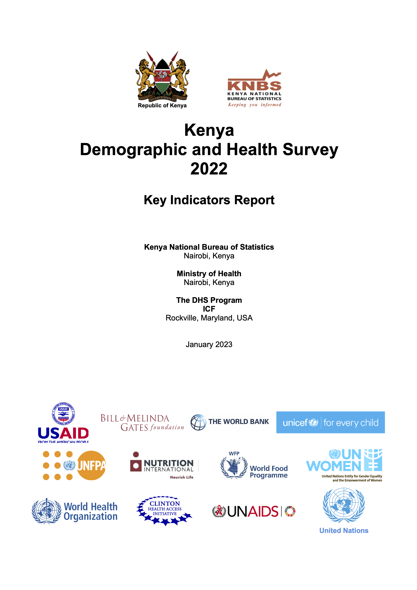

# About

Column {data-width=400}
------------

### Report

```{r, fig.width=7.5, fig.height=7.5, fig.align = 'center', fig.cap= "**KNBS and ICF. 2022. Kenya Demographic and Health Survey 2022. Key Indicators Report. Nairobi, Kenya, and Rockville, Maryland, USA: KNBS and ICF.**"}

```


[Link to the report](https://www.knbs.or.ke/download/2022-kdhs-key-indicators-report/#)

<!-- {out.width='100%', out.height='100%'} -->

<br>
------------------------------------

### About 

- The App uses data from the Key Indicators Report of the 2022 Kenya Demographic and Health Survey (2022 KDHS). The survey was implemented by the Kenya National Bureau of Statistics (KNBS) in collaboration with the Kenya's Ministry of Health (MoH) and other stakeholders.

- It provides easy-to-use interface to explore 2022 KDHS data using tools such as choropleth maps, bar plots, trend plots. This is a living app that is continuously developed to include comparisons of the current results with those from Demographic and Health Surveys.

- The analytics and visualizations are created by the [Center for Epidemiological Modelling and Analysis (CEMA)](http://cema-africa.uonbi.ac.ke) at the University of Nairobi, Kenya.


```{r, include=FALSE}

#setwd("~/")
# load all the required packages
library(pacman)
p_load(shiny)
p_load(docxtractr)
p_load(flexdashboard)
p_load(tidyverse)
p_load(ggiraph)
p_load(scales)
p_load(sf)
p_load(reshape2)
p_load(cowplot)
p_load(data.table)

# import all the tables
dhs2022report <- read_docx("2022KDHSKIR_KNBS.docx") 


# number of tables in the report
docx_tbl_count(dhs2022report)
tbls <- docx_extract_all_tbls(dhs2022report, trim = T, guess_header = T)

```


# Sample survey

## Row {data-width="200"}

<br>

### {.value-box}

```{r}

valueBox(
  value = paste("37,911"),
  caption = "Total Number of Households Interviewed)",
  icon="fa-thumbs-down",
  color = "black"
)
```

### {.value-box}

```{r}
# valueBox(
#   value = paste("19,747"),
#   caption = "Full questionnaires",
#   color = "red"
# )
valueBox(
  value = paste("32,156"),
  caption = "Total Number of Women Interviewed",
  icon="fa-thumbs-up",
  color = "#b15928"
)
```

### {.value-box}

```{r}

# valueBox(
#   value = paste("18,164"),
#   caption = "Short questionnaires",
#   color = "darkgreen"
# )

valueBox(
  value = paste("14,453"),
  caption = "Total Number of Men Interviewed",
  color = "darkgreen",
  icon="fa-thumbs-up"
)
```

<br>

<br>


Column {data-width="600"}
---------------------------------

##### Choose the category to display:

```{r}
selectInput("quest", "",
             c("Households"="All",
               "Participants: Men (15-54 years)"="Male",
               "Participants: Women (15-49 years)"="Female",
               "Response Rates"="Response Rate"))

```


### **Summary of the households selected, occupied, and interviewed for the 2022 Kenya Demographic and Health Survey** 

The numbers are presented by:

  - Type of questionnaire (full or short questionnaires) 
  - Residence: Rural and urban
  - Participants: Men and women

```{r, fig.height=10,fig.height=22}

#### Import the data
## Results of the household interviews
allhhinterviews <- tbls[[3]] %>% # all household interviews
  slice(7:9) %>%
  dplyr::select(V1,V2,V3) %>%
  dplyr::rename(Households = V1,
                Urban = V2,
                Rural = V3) %>%
  dplyr::mutate(selection = "All households")

fqhhinterviews <- tbls[[3]] %>% #full questionnaire household interviews
  slice(20:22,24) %>%
  dplyr::select(V1,V2,V3) %>%
  dplyr::rename(Households = V1,
                Urban = V2,
                Rural = V3) %>%
  dplyr::mutate(selection = "Full questionnaire")

sqhhinterviews <- tbls[[3]] %>% #short questionnaire household interviews
  slice(39:41,43) %>%
  dplyr::select(V1,V2,V3) %>%
  dplyr::rename(Households = V1,
                Urban = V2,
                Rural = V3)%>%
  dplyr::mutate(selection = "Short questionanaire")

interviews <- dplyr::bind_rows(allhhinterviews,fqhhinterviews,sqhhinterviews) %>%
  tidyr::gather(residence,numbers,2:3) %>%
  dplyr::arrange(selection, residence)


kdhshouseholdinterviews <- interviews %>%
  dplyr::mutate(Households = recode(Households, "Households selected" = "Selected","Households occupied" = "Occupied", "Households interviewed" = "Interviewed"))

# include redundant columns in the household data to combine with the participant data
interviewvisuals <- kdhshouseholdinterviews %>%
  mutate(Gender="All") %>% 
  mutate(Participant="All") %>%
  rename(Respondents=Households)


## import data for participant interviews

## Results of participants
allwomen <- tbls[[3]] %>% #women age 15-49 years - from all households
  slice(14:15,17) %>%
  dplyr::select(V1,V2,V3) %>%
  dplyr::rename(Respondents = V1,
                Urban = V2,
                Rural = V3) %>%
  dplyr::mutate(selection = "All households")

fqwomen <- tbls[[3]] %>% #women age 15-49 years - for the full questionnaire
  slice(27:28,30) %>%
  dplyr::select(V1,V2,V3) %>%
  dplyr::rename(Respondents = V1,
                Urban = V2,
                Rural = V3) %>%
  dplyr::mutate(selection = "Full questionnaire")

sqwomen <- tbls[[3]] %>% #women age 15-49 years - for the short questionnaire
  slice(46:47,49) %>%
  dplyr::select(V1,V2,V3) %>%
  dplyr::rename(Respondents = V1,
                Urban = V2,
                Rural = V3) %>%
  dplyr::mutate(selection = "Short questionnaire")

womeninterviews <- dplyr::bind_rows(allwomen,fqwomen,sqwomen) %>%
  tidyr::gather(residence,numbers,2:3) %>%
  dplyr::arrange(selection, residence) %>%
  mutate(Gender = "Female")

#womeninterviews
#write_csv(womeninterviews, "table1_womeninterviewed.csv") ## saves the .csv file of the women 15-59 years interviewed


lqmen <- tbls[[3]] %>% #men 15-54 years - for the full questionnaire
  slice(33:34,36) %>%
  dplyr::select(V1,V2,V3) %>%
  dplyr::rename(Respondents = V1,
                Urban = V2,
                Rural = V3) %>%
  dplyr::mutate(selection = "Full questionnaire")

meninterviews <- lqmen %>%
  tidyr::gather(residence,numbers,2:3) %>%
  dplyr::arrange(selection, residence) %>%
  mutate(Gender = "Male")
  
#meninterviews
#write_csv(meninterviews, "table1_meninterviewed.csv") ## saves .csv file of the men 15-54years interviewed

participantsinterviews <- bind_rows(womeninterviews, meninterviews) %>%
  dplyr::mutate(Participant = recode(Respondents, "Number of eligible women" = "Eligible women","Number of eligible women interviewed" = "Women interviewed", "Number of eligible men" = "Eligible men","Number of eligible men interviewed" = "Men interviewed"))

# join the two datasets
totalinterviewvisuals <- rbind(interviewvisuals ,participantsinterviews)  %>%
  mutate(selection=recode(selection, "Long questionnaire"="Full questionnaires", "Long_questionnaire"="Full questionnaires", "All_households"="All households",
                          "Short_questionnaire"="Short questionnaire", "Short questionanaire"="Short questionnaire")) %>%
  mutate(Participant=ifelse(Respondents%in%c("Eligible men response rate2","Eligible women response rate2","Household response rate1" ), "Response Rate", Participant)) %>%
  mutate(Respondents=recode(Respondents, "Eligible men response rate2"="Eligible men", "Eligible women response rate2"="Eligible women", "Household response rate1"="Household")) %>%
  mutate(numbers=as.numeric(parse_number(numbers)))

totalinterviewvisuals$Respondents <- fct_relevel(totalinterviewvisuals$Respondents,"Number of eligible men interviewed", "Number of eligible women interviewed", "Number of eligible men", "Number of eligible women")
renderPlot({if(input$quest%in%"Response Rate"){
  ggplot(totalinterviewvisuals[totalinterviewvisuals$Participant%in%"Response Rate",], aes(x=Respondents, y=numbers)) + 
  geom_bar(stat = "identity", position = position_dodge(), fill="cyan4") + #"#53A7DC"
  theme_bw() +
  geom_text(aes(label=paste0(round(numbers), "%")), size=5,hjust=1.5, color="white")+scale_y_continuous(label=comma)+
  coord_flip() + labs(x="Households", y="", fill="Residence")+
  facet_grid(residence~selection) +
  theme(text= element_text(size = 20, colour = "black", face = "bold")) +
  theme(strip.background =element_rect(fill="darkorange"))
        
} else
 ggplot(totalinterviewvisuals[totalinterviewvisuals$Gender%in%input$quest & totalinterviewvisuals$Participant!="Response Rate",], aes(x=Respondents, y=numbers)) + 
  geom_bar(stat = "identity", position = position_dodge(), fill="cyan4") + #"#53A7DC"
  theme_bw() +
  geom_text(aes(label=format(numbers, big.mark=",")), size=5,hjust=1.5, color="white")+scale_y_continuous(label=comma)+
  coord_flip() + labs(x="Households", y="", fill="Residence")+
  facet_grid(residence~selection) +
  theme(text= element_text(size = 20, colour = "black", face = "bold")) +
  theme(strip.background =element_rect(fill="darkorange"))
        }, width = 1200, height=600) 


```


<!-- Key Indicators {data-navmenu="Key Indicators"} -->
<!-- ================================ -->

<!-- Inputs {.sidebar} -->
<!-- ----------------------------------- -->
<!-- <br> -->

<!-- [Characteristics of Respondents](#respondents_characteristics)</br> -->

<!-- [Health Insurance Coverage](#health_insurance)</br> -->

<!-- [Disability among the household population](#disability_pop)</br> -->

<!-- [Fertility rates](#fertility)</br> -->

<!-- [Teenage pregnancy](#teenage_pregnancy)</br> -->

<!-- [Current use of contraception](#contraception_use)</br> -->

<!-- [Family planning need and demand among married women](#family_planning)</br> -->

<!-- [Maternal care](#maternal_care)</br> -->

<!-- [Vaccinations](#vaccinations)</br> -->

<!-- [Nutritional status](#nutr_status)</br> -->

<!-- [Insecticide treated nets](#treated_nets)</br> -->

<!-- [Knowledge about HIV prevention methods among young people](#hiv_prev)</br> -->

<!-- [Coverage of prior HIV testing](#hiv_test)</br> -->


<!-- [House ownership](#home_ownership)</br> -->

<!-- [Agricultural land ownership](#agric_land_ownership)</br> -->

<!-- [Non-agricultural land ownership](#nonagric_land_ownership)</br> -->

<!-- [Gender based violence](#physical_violence)</br> -->

<!-- <!-- [Female genital mutilation](#female_genital)</br> --> 


Characteristics of Respondents {data-navmenu="Key Indicators"}
==================

<!-- Inputs {.sidebar} -->
<!-- ----------------------------------- -->
<!-- <br> -->

<!-- [Characteristics of Respondents](#respondents_characteristics)</br> -->

<!-- [Health Insurance Coverage](#health_insurance)</br> -->

<!-- [Disability among the household population](#disability_pop)</br> -->

<!-- [Fertility rates](#fertility)</br> -->

<!-- [Teenage pregnancy](#teenage_pregnancy)</br> -->

<!-- [Current use of contraception](#contraception_use)</br> -->

<!-- [Family planning need and demand among married women](#family_planning)</br> -->

<!-- [Maternal care](#maternal_care)</br> -->

<!-- [Vaccinations](#vaccinations)</br> -->

<!-- [Nutritional status](#nutr_status)</br> -->

<!-- [Insecticide treated nets](#treated_nets)</br> -->

<!-- [Knowledge about HIV prevention methods among young people](#hiv_prev)</br> -->

<!-- [Coverage of prior HIV testing](#hiv_test)</br> -->

<!-- [House ownership](#home_ownership)</br> -->

<!-- [Agricultural land ownership](#agric_land_ownership)</br> -->

<!-- [Non-agricultural land ownership](#nonagric_land_ownership)</br> -->

<!-- [Gender based violence](#physical_violence)</br> -->

<!-- <!-- [Female genital mutilation](#female_genital)</br> --> 


## Row {data-width="200"}

<br>

### {.value-box}

```{r}

valueBox(
  value = paste("32,156"),
  caption = "Number of women interviewed",
  color = "#b15928",
  icon='fa-female,'
)
```

### {.value-box}

```{r}
valueBox(
  value = paste("14,453"),
  caption = "Number of men interviewed",
  color = "darkgreen",
  icon='fa-male'
)
```

<br>

Column {data-width="600"}
-----------------------

#### **The background characteristics of the women and men interviewed in the 2022 KDHS**

*For each characteristic, we show the weighted percentage distributions of the women and men that participated in the survey. Choose the characteristic to display.*


```{r}

selectInput("char", "",
             c("Age of respondent"="Age",
               "Self-reported health status"="Health_Status",
               "Religion"="Religion",
               "Marital status (15-49years)"="Marital_Status",
               "Residence"="Residence",
               "Education status (highest level attended)"="Education_Status",
               "Wealth Quintile"="Wealth_Quintile",
               "By County"="County",
               "By County: Men" = "Men",
               "By County: Women"= "Women"))

```


```{r, include=F}

respondentsbyage <- fread("table2_ageparticipants.csv")%>%
  mutate(Indicator="Age")%>%
  rename(Grouping=Age)

# reported health status data
healthstatus <- fread("table2_selfreport_healthstatus.csv") %>%
  mutate(Health_status = fct_relevel(Health_status, 
            "Very bad","Bad","Moderate","Good","Very good"))%>%
  mutate(Indicator="Health_Status")%>%
  rename(Grouping=Health_status)

# religion
religionrespondents <- fread("table2_religionparticipants.csv") %>%
  mutate(Religion = fct_relevel(Religion, "Other","No religion", "Muslim","Catholic","Protestant/other Christian")) %>%
  mutate(Indicator="Religion") %>%
  rename(Grouping=Religion)

# Marital status
maritalstatusrespondents <- fread("table2_maritalstatusparticipants.csv") %>%
  mutate(Marital_status = fct_relevel(Marital_status, "Widowed","Living together", "Divorced/separated","Never married","Married")) %>% 
  mutate(Indicator="Marital_Status") %>%
  rename(Grouping=Marital_status)

# Place of residence 
residentrespondents <- fread("table2_residenceparticipants.csv") %>%
  mutate(Residence = fct_relevel(Residence, "Urban", "Rural")) %>%
  mutate(Indicator="Residence") %>%
  rename(Grouping=Residence)

# Education status
educationrespondents <- fread("table2_educationstatusparticipants.csv")  %>%
  mutate(Education_status = fct_relevel(Education_status, "Vocational", "More than secondary","Secondary", "Primary", "No education")) %>%
  mutate(Indicator="Education_Status") %>%
  rename(Grouping=Education_status)

# Wealth quintile
economicstatusrespondents <- fread("table2_economicstatus15_49.csv")  %>%
  mutate(Wealth_quintile = fct_relevel(Wealth_quintile, "Lowest", "Second","Middle", "Fourth", "Highest")) %>%
  mutate(Indicator="Wealth_Quintile") %>%
  rename(Grouping=Wealth_quintile)

# By county
countyrespondents <- fread("table2_participantsbycounty.csv") %>%
  arrange(desc(Weighted_percent)) %>%
  mutate(Indicator="County") %>%
  rename(Grouping=County)


  
# join the datasets with participants characteristics

respondentsdata <- rbind(respondentsbyage, healthstatus, religionrespondents, maritalstatusrespondents, residentrespondents, educationrespondents, economicstatusrespondents, countyrespondents) %>%
  mutate(Indicator1=Indicator) %>%
  mutate(Indicator1=recode(Indicator1, "Education_Status"="Education Status", "Health_Status"="Health Status", "Marital_Status"="Marital Status", "Wealth_Quintile"="Wealth Quintile")) %>%
  mutate(label=ifelse(Weighted_percent<0.5, "<1%", paste0(round(Weighted_percent),"%")))

respondentsdata$Grouping <- fct_relevel(respondentsdata$Grouping, "Lowest", "Second", "Middle", "Fourth", "Highest", #wealth quintile
                                        'No education','Primary','Secondary','More than secondary', 'Vocational', #Education
                                        "Protestant/other Christian","Catholic", "Muslim","No religion","Other", #Religion
                                        "Very good","Good","Moderate","Bad","Very bad", #Reported health status
                                        "Married","Never married","Divorced/separated","Living together","Widowed") #Marital status

## county data

### men
men_background_xtics_county <- fread("table2C_men_backgroundxtics_by_county.csv") %>%
  mutate(group="Men")

county <- st_read("County.shp")%>%
  mutate(region=ifelse(Name%in%c("Kilifi","Kwale","Lamu", "Mombasa", "Taita Taveta", "Tana River"),"Coast", ifelse(Name%in%c("Garissa", "Mandera", "Wajir"),"North Eastern", ifelse(Name%in%c("Marsabit","Isiolo","Meru","Tharaka Nithi","Embu","Kitui","Machakos","Makueni"),"Eastern", ifelse(Name%in%c("Kiambu", "Kirinyaga","Muranga","Nyandarua", "Nyeri"),"Central", ifelse(Name%in%c("Bungoma",
 "Busia","Kakamega","Vihiga"),"Western", ifelse(Name%in%c("Kisumu", "Siaya","Homa Bay","Kisii", "Migori","Nyamira"),"Nyanza", ifelse(Name%in%"Nairobi","Nairobi", "Rift Valley"))))))))%>%
  rename(County=Name)

men_background_xtics_county1 <- full_join(county, men_background_xtics_county, by="County")%>%
  mutate(names=paste0(County,", ", weighted_perc,"%"))

### women
women_background_xtics_county <- fread("table2C_women_backgroundxtics_by_county.csv") %>%
  mutate(group="Women")

women_background_xtics_county1 <- full_join(county, women_background_xtics_county, by="County")%>%
  mutate(names=paste0(County,", ", weighted_perc,"%"))

background_characteristics_map <- rbind(women_background_xtics_county1, men_background_xtics_county1)
```


```{r, fig.width= 16, fig.height=12}

# visualize the data
# renderPlot({
#   if (input$char%in%c("Wealth_Quintile", "Age")){
#    respondentsdata%>%
#     filter(Indicator==input$char)%>%
#     ggplot(aes(x=Grouping, y=Weighted_percent, color = Participants)) + 
#   geom_point(stat = "identity", size= 20) + 
#   theme_bw() +
#   geom_text(aes(label=paste0(Weighted_percent,"%")), hjust = 0.5, size=4, color="white")+
#   labs(y="Weighted percent (%)",x=paste0(unique(respondentsdata[respondentsdata$Indicator==input$char,]$Indicator1), " of respondents"), fill="Gender") +scale_color_manual(values=c("darkgreen", "red"))+
#   theme(text=element_text(size=18, face="bold"))}
#     else if(input$char%in%"County"){
#       respondentsdata%>%
#     filter(Indicator==input$char)%>%
#       ggplot(aes(x=reorder(Grouping,Weighted_percent), y=Weighted_percent, fill = Participants)) + 
#   geom_col(stat = "identity", size= 10) + coord_flip()+
#   theme_bw() +
#   geom_text(aes(label=Weighted_percent), position=position_stack(vjust = 0.5), size=4, color="white", label.size=0.7)+
#   labs(y="Weighted percent (%)",x=paste0(unique(respondentsdata[respondentsdata$Indicator==input$char,]$Indicator1), " of respondents"), fill="Gender") +scale_fill_manual(values=c("darkgreen", "red"))+
#   theme(text=element_text(size=20, face="bold")) 
#       
#     } else {
#      respondentsdata%>%
#     filter(Indicator==input$char)%>%
#     ggplot(aes(x=Grouping, y=Weighted_percent, fill = Participants)) + 
#   geom_col(stat = "identity", size= 10) + 
#   theme_bw() +
#   geom_text(aes(label=Weighted_percent), position=position_stack(vjust = 0.5), size=4, fill="white")+
#   labs(y="Weighted percent (%)",x=paste0(unique(respondentsdata[respondentsdata$Indicator==input$char,]$Indicator1), " of respondents"), fill="Gender") +scale_fill_manual(values=c("darkgreen", "red"))+
#   theme(text=element_text(size=20, face="bold")) 
#     }
#   }, width = 1420, height=700)
  

renderGirafe({
  if (input$char%in%c("Wealth_Quintile", "Age")){
  respondents_map1 <- respondentsdata%>%
    filter(Indicator==input$char)%>%
    ggplot(aes(x=Grouping, y=Weighted_percent)) + 
  geom_point(stat = "identity", size= 20, color = "cyan4")+#, aes(tooltip=paste0(Weighted_percent, "%"))) + 
  theme_bw() +
      facet_grid(~Participants) +
  geom_text(aes(label=label), hjust = 0.5, size=4, color="white", face = "bold")+
  #labs(y="Percent (%)",x=paste0(unique(respondentsdata[respondentsdata$Indicator==input$char,]$Indicator1), " of respondents"), fill="Gender") +
      labs(y="Percent (%)", x="")  +
     # scale_color_manual(values=c("cyan4", "red4"))+
       theme(strip.background =element_rect(fill="darkorange")) +
  theme(text=element_text(size=20, face="bold"))
   respondents_map1a<-girafe(ggobj = respondents_map1,
                   options = list(
                     opts_hover(css = "fill:#666666;cursor:pointer;"),
                     opts_selection(css = "fill:orange;", type = "multiple"),
                     #opts_sizing(width = .7),
                     opts_zoom(max = 4)), width=18, height=10)
  print(respondents_map1a)
    } else if(input$char%in%"County"){
 respondents_map2 <-respondentsdata%>%
    filter(Indicator==input$char)%>%
      ggplot(aes(x=reorder(Grouping,Weighted_percent), y=Weighted_percent)) + 
  geom_bar(stat = "identity", size= 10, fill = "cyan4") + coord_flip()+
  theme_bw() +
        facet_grid(~Participants) +
  geom_text(aes(label=label), hjust = -0.1, size=4, color="black", face = "bold", label.size=0.7)+
#  labs(y="Weighted percent (%)",x=paste0(unique(respondentsdata[respondentsdata$Indicator==input$char,]$Indicator1), " of respondents"), fill="Gender") + 
         labs(y="Percent (%)", x="") + 
      #  scale_fill_manual(values=c("cyan4", "red4"))+
  theme(text=element_text(size=20, face="bold")) + theme(strip.background =element_rect(fill="darkorange"))
 respondents_map2a<-girafe(ggobj = respondents_map2,
                   options = list(
                     opts_hover(css = "fill:#666666;cursor:pointer;"),
                     opts_selection(css = "fill:orange;", type = "multiple"),
                     opts_sizing(width = .7),
                     opts_zoom(max = 4)), width=18, height=10)
  print(respondents_map2a)

  }  else if(input$char%in%c("Religion", "Marital_Status")){
  respondents_map3 <- respondentsdata%>%
    filter(Indicator==input$char)%>%
      ggplot(aes(x=reorder(Grouping,Weighted_percent), y=Weighted_percent)) + 
  geom_bar(stat = "identity", size= 10, fill = "cyan4") + coord_flip()+
  theme_bw() +
        facet_grid(~Participants) +
  #labs(y="Percentage (%)",x=paste0(unique(respondentsdata[respondentsdata$Indicator==input$char,]$Indicator1), " of respondents"), fill="Gender") + 
         labs(y="Percent (%)", x="") + 
        scale_fill_manual(values=c("cyan4", "red4"))+
  theme(text=element_text(size=18, face="bold")) + theme(strip.background =element_rect(fill="darkorange"))+
      geom_text(aes(label=label), position=position_stack(vjust = 0.7), size=4, color="white", face = "bold", label.size=0.7)
   respondents_map3a<-girafe(ggobj = respondents_map3,
                   options = list(
                     opts_hover(css = "fill:#666666;cursor:pointer;"),
                     opts_selection(css = "fill:orange;", type = "multiple"),
                     opts_sizing(width = .7),
                     opts_zoom(max = 4)), width=18, height=10)
  print(respondents_map3a)
  } 
  else if (input$char%in%c("Men", "Women")){
    background_xtics <- ggplot(background_characteristics_map[background_characteristics_map$group%in%input$char,], aes(fill=weighted_perc))+ geom_sf_interactive(aes(tooltip=names),color="grey80", size=0.0)+
  theme_void()+
  scale_fill_gradient(low = "#fee6ce", high = "#7f2704")+
  labs(x="", y="",fill="Percentage")+
  theme(text=element_text(size=14))
   background_map <- girafe(ggobj = background_xtics,
                   options = list(
                     opts_hover(css = "fill:#666666;cursor:pointer;"),
                     opts_selection(css = "fill:orange;", type = "multiple"),
                     opts_sizing(width = .7),
                     opts_zoom(max = 4)), width=18, height=10)
    print(background_map)
  }
  else{
  respondents_map4 <- respondentsdata%>%
    filter(Indicator==input$char)%>%
    ggplot(aes(x=Grouping, y=Weighted_percent)) + 
  geom_bar(stat = "identity", size= 10, fill = "cyan4")+ #aes(tooltip=paste0(Weighted_percent, "%"))) + 
  theme_bw() +
        facet_grid(~Participants) +
  geom_text(aes(label=label), position=position_stack(vjust = 0.5), size=5, color="white")+
 # labs(y="Weighted percent (%)",x=paste0(unique(respondentsdata[respondentsdata$Indicator==input$char,]$Indicator1), " of respondents"), fill="Gender") +scale_fill_manual(values=c("cyan4", "red4"))+
         labs(y="Percent (%)", x="") +
  theme(text=element_text(size=18, face="bold")) +  theme(strip.background =element_rect(fill="darkorange")) 
    respondents_map4a<-girafe(ggobj = respondents_map4,
                   options = list(
                     opts_hover(css = "fill:#666666;cursor:pointer;"),
                     opts_selection(css = "fill:orange;", type = "multiple"),
                     opts_zoom(max = 4)), width=18, height=10)
  print(respondents_map4a)
  }  
  })
  
```


<br>


Health Insurance Coverage {data-navmenu="Key Indicators"}
==================

<!-- Inputs {.sidebar} -->
<!-- ----------------------------------- -->
<!-- <br> -->

<!-- [Characteristics of Respondents](#respondents_characteristics)</br> -->

<!-- [Health Insurance Coverage](#health_insurance)</br> -->

<!-- [Disability among the household population](#disability_pop)</br> -->

<!-- [Fertility rates](#fertility)</br> -->

<!-- [Teenage pregnancy](#teenage_pregnancy)</br> -->

<!-- [Current use of contraception](#contraception_use)</br> -->

<!-- [Family planning need and demand among married women](#family_planning)</br> -->

<!-- [Maternal care](#maternal_care)</br> -->

<!-- [Vaccinations](#vaccinations)</br> -->

<!-- [Nutritional status](#nutr_status)</br> -->

<!-- [Insecticide treated nets](#treated_nets)</br> -->

<!-- [Knowledge about HIV prevention methods among young people](#hiv_prev)</br> -->

<!-- [Coverage of prior HIV testing](#hiv_test)</br> -->

<!-- [House ownership](#home_ownership)</br> -->

<!-- [Agricultural land ownership](#agric_land_ownership)</br> -->

<!-- [Non-agricultural land ownership](#nonagric_land_ownership)</br> -->

<!-- [Gender based violence](#physical_violence)</br> -->

<!-- <!-- [Female genital mutilation](#female_genital)</br> --> 


## Row {data-width="200"} 

<br>

### {.value-box}

```{r}

valueBox(
value = paste("26%"),
   caption = "Of women have a form of health insurance",
   color = "#b15928", 
   icon='fa-female,' 
 ) 
``` 

### {.value-box}

```{r}
 valueBox( 
   value = paste("26.5%"), 
   caption = "Of men have a form of health insurance", 
   color = "darkgreen", 
   icon='fa-male' 
 )
 
```

Row {data-height="230"}
------------------------------- 

### **Health Insurance Coverage:**

*Health insurance improves access to quality health care by reducing the costs associated with illness, treatment and care incurred by persons and/or families. The graphics show the percentage of de jure household members with insurance and the type of insurance.* 

**Choose the characteristics to display:**

```{r}
selectInput("health", "",
              c("Age in Years"="Age_category", 
                "Residence"="Residence", 
                "Wealth quintile"="Wealth_quintile"))
```


Row {data-height="600"}
------------------------------- 

### .

```{r, fig.width=16 }
# health insurance data by age
healthinsurancebyage <- fread("table3_healthinsurancebyage.csv") %>%
  tidyr::gather(Insurance,Coverage,2:7) %>%
  mutate(Insurance=recode(Insurance,"Any_health_insurance"="Form of health insurance", "None_DontKnow"="None/ Don't Know")) %>%
  rename(Indicator=Age_category) %>%
  mutate(Indicator1="Age_category")

# health insurance data by residence
healthinsurancebyresidence <-fread("table3_healthinsurancebyresidence.csv") %>%
  tidyr::gather(Insurance,Coverage,2:7) %>%
  mutate(Insurance=recode(Insurance,"Any_health_insurance"="Form of health insurance", "None_DontKnow"="None/ Don't Know")) %>%
  rename(Indicator=Residence) %>%
  mutate(Indicator1="Residence")

# Wealth quintile
healthinsurancebywealthquintile <- fread( "table3_healthinsurancebywealthquintile.csv") %>%
  tidyr::gather(Insurance,Coverage,2:7) %>%
  mutate(Insurance=recode(Insurance,"Any_health_insurance"="Form of health insurance", "None_DontKnow"="None/ Don't Know")) %>%
  rename(Indicator=Wealth_quintile) %>%
  mutate(Indicator1="Wealth_quintile")
  
# total health insurance data
healthinsurance <- rbind(healthinsurancebyage,healthinsurancebyresidence,healthinsurancebywealthquintile) %>%
  mutate(Insurance=recode(Insurance, "Community_based"="Community based", "Private_commercial"="Private/commercial")) %>%
  mutate(label=ifelse(Coverage<0.5, "<1%", paste0(round(Coverage),"%")))


healthinsurance$Indicator <- fct_relevel(healthinsurance$Indicator, "Lowest", "Second", "Middle", "Fourth", "Highest")

healthinsurance$Insurance <- fct_relevel(healthinsurance$Insurance, "NHIF", "Private/commercial", "Community based", "Other", "Form of health insurance", "None/ Don't Know")

renderPlot({
  if(input$health%in%"Wealth_quintile"){
    ggplot(healthinsurance[healthinsurance$Indicator1%in%input$health,], aes(x=Indicator, y=Coverage, fill=Participants))+geom_bar(stat = 'identity', position = position_dodge())+#,aes(tooltip=paste0(Coverage, "%"))) +
  facet_grid(.~Insurance)+labs(y="Percent (%)", x="")+
    scale_fill_brewer(palette = "Set1")+coord_flip()+
    theme_bw()+theme(text=element_text(size=16, face = "bold")) +
    theme(strip.background =element_rect(fill="darkorange"))+
    geom_text(aes(label=label), position=position_dodge(0.5),vjust=0.5, size=4, color="black")
  #  insurance_map1a<-girafe(ggobj = insurance_map1,width_svg=18, height_svg=9,
  #                 options = list(
  #                   opts_hover(css = "fill:#666666;cursor:pointer;"),
  #                   opts_selection(css = "fill:orange;", type = "multiple"),
                    # opts_sizing(rescale = TRUE),
   #                  opts_zoom(max = 4)))
  #print(insurance_map1a)
  }else{ 
  ggplot(healthinsurance[healthinsurance$Indicator1%in%input$health,], aes(x=Indicator, y=Coverage, fill=Participants))+geom_bar(stat = 'identity', position = position_dodge())+
  facet_grid(.~Insurance)+labs(x="", y="Percent (%)")+
    scale_fill_brewer(palette = "Set1")+ 
    theme_bw()+theme(text=element_text(size=20, face = "bold")) +
    theme(strip.background =element_rect(fill="darkorange"))+
       geom_text(aes(label=label), position=position_dodge(0.7),vjust=-0.5,hjust=0.4, size=4, color="black")
  #insurance_map2a<-girafe(ggobj = insurance_map2, width_svg=18, height_svg=9,
   #                options = list(
    #                 opts_hover(css = "fill:#666666;cursor:pointer;"),
     #                opts_selection(css = "fill:orange;", type = "multiple"),
                  #   opts_sizing(rescale=TRUE),
      #               opts_zoom(max = 4)))
 # print(insurance_map2a, justify="left")
  }
})


```

Disability among the household population {data-navmenu="Key Indicators"}
==================

<!-- Inputs {.sidebar} -->
<!-- ----------------------------------- -->
<!-- <br> -->

<!-- [Characteristics of Respondents](#respondents_characteristics)</br> -->

<!-- [Health Insurance Coverage](#health_insurance)</br> -->

<!-- [Disability among the household population](#disability_pop)</br> -->

<!-- [Fertility rates](#fertility)</br> -->

<!-- [Teenage pregnancy](#teenage_pregnancy)</br> -->

<!-- [Current use of contraception](#contraception_use)</br> -->

<!-- [Family planning need and demand among married women](#family_planning)</br> -->

<!-- [Maternal care](#maternal_care)</br> -->

<!-- [Vaccinations](#vaccinations)</br> -->

<!-- [Nutritional status](#nutr_status)</br> -->

<!-- [Insecticide treated nets](#treated_nets)</br> -->

<!-- [Knowledge about HIV prevention methods among young people](#hiv_prev)</br> -->

<!-- [Coverage of prior HIV testing](#hiv_test)</br> -->

<!-- [House ownership](#home_ownership)</br> -->

<!-- [Agricultural land ownership](#agric_land_ownership)</br> -->

<!-- [Non-agricultural land ownership](#nonagric_land_ownership)</br> -->

<!-- [Gender based violence](#physical_violence)</br> -->

<!-- <!-- [Female genital mutilation](#female_genital)</br> --> 


## Row {data-width="200"}


### {.value-box}

```{r}

valueBox(
  value = paste("16%"),
  caption = "Some difficulty",
  color = "black"
)
```

### {.value-box}

```{r}
valueBox(
  value = paste("5%"),
  caption = "Alot of difficulty",
  color = "#b15928"
)
```

### {.value-box}

```{r}

valueBox(
  value = paste("0.5%"),
  caption = "Cannot do anything at all",
  color = "darkgreen"
)
```

<br>

Row {data-height="200"}
-----------------------

### Disability: choose a characteristic to display by:

```{r}

selectInput("disability", "",
              c("Summary"="All",
                "Age category (in years)"="Age_category", 
                "Marital Status (15-49years)"="Marital_status", 
                "Residence"="Residence",
                "Education status (highest level attended)"="Education_status",
                "Wealth quintile"="Wealth_quintile"), width=400)
```

### Choose  a disability domain:

```{r }
selectInput("disability_domain", "",
              c("All domains"="All",
                "Seeing"="Seeing", 
                "Hearing"="Hearing", 
                "Communicating"="Communicating",
                "Remembering/Concentrating"="Remembering_concentrating","Walking/ClimbingSteps"="Walking/Climbing steps",
                "Washing all over/Dressing"="Washing all over/Dressing"), width=250)

```

Row {data-height="600"}
-----------------------

### .


```{r }
# disability by age

## import data ## Extracted Table 9 - has information on disability

disabilitytotal <-  tbls[[9]]  %>% 
  slice(34) %>%
  dplyr::rename(Age_category = V1,
                No_difficulty = V2,
                Seeing = V3,
                Hearing = V4,
                Communicating = V5,
                Remembering_concentrating = V6,
                Walking_ClimbingSteps = V7,
                WashingAllOver_dressing = V8,
                SomeDifficulty = V9,
                A_lot_of_difficulty = V10,
                Cannot_do_at_all = V11,
                A_lot_of_difficulty_cannot_do_at_all = V12,
                A_lot_of_difficulty_cannot_do_at_all_more_than_one_domain = V13,
                Number = V14) %>%
  dplyr::mutate(Participants = "All") %>%
  mutate(Indicator1 ="All") %>%
  rename(Indicator=Age_category)

disabilitywomenbyage <- tbls[[9]] %>% ## Extracted Table 9 - has information on disability by women
  slice(6:8) %>% #Age data rows
  dplyr::rename(Age_category = V1,
                No_difficulty = V2,
                Seeing = V3,
                Hearing = V4,
                Communicating = V5,
                Remembering_concentrating = V6,
                Walking_ClimbingSteps = V7,
                WashingAllOver_dressing = V8,
                SomeDifficulty = V9,
                A_lot_of_difficulty = V10,
                Cannot_do_at_all = V11,
                A_lot_of_difficulty_cannot_do_at_all = V12,
                A_lot_of_difficulty_cannot_do_at_all_more_than_one_domain = V13,
                Number = V14) %>%
  dplyr::mutate(Participants = "Women")

disabilitymenbyage <- tbls[[10]] %>% ## Extracted Table 10 - has information on disability by men
  slice(6:8) %>% # Age data rows
  dplyr::rename(Age_category = V1,
                No_difficulty = V2,
                Seeing = V3,
                Hearing = V4,
                Communicating = V5,
                Remembering_concentrating = V6,
                Walking_ClimbingSteps = V7,
                WashingAllOver_dressing = V8,
                SomeDifficulty = V9,
                A_lot_of_difficulty = V10,
                Cannot_do_at_all = V11,
                A_lot_of_difficulty_cannot_do_at_all = V12,
                A_lot_of_difficulty_cannot_do_at_all_more_than_one_domain = V13,
                Number = V14) %>%
  dplyr::mutate(Participants = "Men")

disabilitybyage <- bind_rows(disabilitywomenbyage,disabilitymenbyage) %>%
  mutate(Indicator1 ="Age_category") %>%
  rename(Indicator=Age_category)

# disability by marital status
disabilitywomenbymaritalstatus <- tbls[[9]] %>% ## Extracted Table 9 - has information on disability by women
  slice(11:15) %>% #marital status data rows
  dplyr::rename(Marital_status = V1,
                No_difficulty = V2,
                Seeing = V3,
                Hearing = V4,
                Communicating = V5,
                Remembering_concentrating = V6,
                Walking_ClimbingSteps = V7,
                WashingAllOver_dressing = V8,
                SomeDifficulty = V9,
                A_lot_of_difficulty = V10,
                Cannot_do_at_all = V11,
                A_lot_of_difficulty_cannot_do_at_all = V12,
                A_lot_of_difficulty_cannot_do_at_all_more_than_one_domain = V13,
                Number = V14) %>%
  dplyr::mutate(Participants = "Women")

disabilitymenbymaritalstatus <- tbls[[10]] %>% ## Extracted Table 10 - has information on disability by men
  slice(11:15) %>% # marital status data rows
  dplyr::rename(Marital_status = V1,
                No_difficulty = V2,
                Seeing = V3,
                Hearing = V4,
                Communicating = V5,
                Remembering_concentrating = V6,
                Walking_ClimbingSteps = V7,
                WashingAllOver_dressing = V8,
                SomeDifficulty = V9,
                A_lot_of_difficulty = V10,
                Cannot_do_at_all = V11,
                A_lot_of_difficulty_cannot_do_at_all = V12,
                A_lot_of_difficulty_cannot_do_at_all_more_than_one_domain = V13,
                Number = V14) %>%
  dplyr::mutate(Participants = "Men")

disabilitybymaritalstatus <- bind_rows(disabilitywomenbymaritalstatus,disabilitymenbymaritalstatus) %>%
  mutate(Indicator1="Marital_status") %>%
  rename(Indicator=Marital_status)

# disability by residence
disabilitywomenbyresidence <- tbls[[9]] %>% ## Extracted Table 9 - has information on disability by women
  slice(18:19) %>% # residence data rows
  dplyr::rename(Residence = V1,
                No_difficulty = V2,
                Seeing = V3,
                Hearing = V4,
                Communicating = V5,
                Remembering_concentrating = V6,
                Walking_ClimbingSteps = V7,
                WashingAllOver_dressing = V8,
                SomeDifficulty = V9,
                A_lot_of_difficulty = V10,
                Cannot_do_at_all = V11,
                A_lot_of_difficulty_cannot_do_at_all = V12,
                A_lot_of_difficulty_cannot_do_at_all_more_than_one_domain = V13,
                Number = V14) %>%
  dplyr::mutate(Participants = "Women")

disabilitymenbyresidence <- tbls[[10]] %>% ## Extracted Table 10 - has information on disability by men
  slice(18:19) %>% # residence data rows
  dplyr::rename(Residence = V1,
                No_difficulty = V2,
                Seeing = V3,
                Hearing = V4,
                Communicating = V5,
                Remembering_concentrating = V6,
                Walking_ClimbingSteps = V7,
                WashingAllOver_dressing = V8,
                SomeDifficulty = V9,
                A_lot_of_difficulty = V10,
                Cannot_do_at_all = V11,
                A_lot_of_difficulty_cannot_do_at_all = V12,
                A_lot_of_difficulty_cannot_do_at_all_more_than_one_domain = V13,
                Number = V14) %>%
  dplyr::mutate(Participants = "Men")

disabilitybyresidence <- bind_rows(disabilitywomenbyresidence,disabilitymenbyresidence) %>%
  mutate(Indicator1 = "Residence") %>%
  rename(Indicator=Residence)

# disability by education status
disabilitywomenbyeducationstatus <- tbls[[9]] %>% ## Extracted Table 9 - has information on disability by women
  slice(22:25) %>% # Education status data rows
  dplyr::rename(Education_status = V1,
                No_difficulty = V2,
                Seeing = V3,
                Hearing = V4,
                Communicating = V5,
                Remembering_concentrating = V6,
                Walking_ClimbingSteps = V7,
                WashingAllOver_dressing = V8,
                SomeDifficulty = V9,
                A_lot_of_difficulty = V10,
                Cannot_do_at_all = V11,
                A_lot_of_difficulty_cannot_do_at_all = V12,
                A_lot_of_difficulty_cannot_do_at_all_more_than_one_domain = V13,
                Number = V14) %>%
  dplyr::mutate(Participants = "Women")

disabilitymenbyeducationstatus <- tbls[[10]] %>% ## Extracted Table 10 - has information on disability by men
  slice(22:25) %>% # Educcation status data rows
  dplyr::rename(Education_status= V1,
                No_difficulty = V2,
                Seeing = V3,
                Hearing = V4,
                Communicating = V5,
                Remembering_concentrating = V6,
                Walking_ClimbingSteps = V7,
                WashingAllOver_dressing = V8,
                SomeDifficulty = V9,
                A_lot_of_difficulty = V10,
                Cannot_do_at_all = V11,
                A_lot_of_difficulty_cannot_do_at_all = V12,
                A_lot_of_difficulty_cannot_do_at_all_more_than_one_domain = V13,
                Number = V14) %>%
  dplyr::mutate(Participants = "Men")

disabilitybyeducationstatus <- bind_rows(disabilitywomenbyeducationstatus,disabilitymenbyeducationstatus) %>%
  mutate(Indicator1 ="Education_status") %>%
  rename(Indicator=Education_status)
 
#disability by wealth quintile
disabilitywomenbywealthquintile <- tbls[[9]] %>% ## Extracted Table 9 - has information on disability by women
  slice(28:32) %>% # wealth quintile data rows
  dplyr::rename(Wealth_quintile = V1,
                No_difficulty = V2,
                Seeing = V3,
                Hearing = V4,
                Communicating = V5,
                Remembering_concentrating = V6,
                Walking_ClimbingSteps = V7,
                WashingAllOver_dressing = V8,
                SomeDifficulty = V9,
                A_lot_of_difficulty = V10,
                Cannot_do_at_all = V11,
                A_lot_of_difficulty_cannot_do_at_all = V12,
                A_lot_of_difficulty_cannot_do_at_all_more_than_one_domain = V13,
                Number = V14) %>%
  dplyr::mutate(Participants = "Women")

disabilitymenbywealthquintile <- tbls[[10]] %>% ## Extracted Table 10 - has information on disability by men
  slice(28:32) %>% # wealth quintile data rows
  dplyr::rename(Wealth_quintile= V1,
                No_difficulty = V2,
                Seeing = V3,
                Hearing = V4,
                Communicating = V5,
                Remembering_concentrating = V6,
                Walking_ClimbingSteps = V7,
                WashingAllOver_dressing = V8,
                SomeDifficulty = V9,
                A_lot_of_difficulty = V10,
                Cannot_do_at_all = V11,
                A_lot_of_difficulty_cannot_do_at_all = V12,
                A_lot_of_difficulty_cannot_do_at_all_more_than_one_domain = V13,
                Number = V14) %>%
  dplyr::mutate(Participants = "Men")

disabilitybywealthquintile <- bind_rows(disabilitywomenbywealthquintile,disabilitymenbywealthquintile) %>%
  mutate(Indicator1="Wealth_quintile") %>%
  rename(Indicator=Wealth_quintile)
  
disabilitydata <- rbind(disabilitybyage, disabilitybymaritalstatus, disabilitybyresidence, disabilitybyeducationstatus, disabilitybywealthquintile, disabilitytotal) %>%
  pivot_longer(c(No_difficulty, SomeDifficulty, A_lot_of_difficulty, Cannot_do_at_all, A_lot_of_difficulty_cannot_do_at_all, A_lot_of_difficulty_cannot_do_at_all_more_than_one_domain, Seeing, Hearing,Communicating, Remembering_concentrating, Walking_ClimbingSteps, WashingAllOver_dressing), names_to="difficulty", values_to="difficultyprop") %>%
  filter(difficulty%in%c("A_lot_of_difficulty","SomeDifficulty", "Cannot_do_at_all", "Seeing", "Hearing","Communicating", "Remembering_concentrating", "Walking_ClimbingSteps", "WashingAllOver_dressing"))%>%
  mutate(difficulty=recode(difficulty, "A_lot_of_difficulty"="Alot of difficulty", "SomeDifficulty"="Some Difficulty","Cannot_do_at_all"="Cannot do at all", "Remembering_concetrating"="Remembering/Concentrating", "Walking_ClimbingSteps"="Walking/Climbing steps","WashingAllOver_dressing"="Washing all over/Dressing"  ))%>%
  mutate(difficulty=fct_relevel(difficulty, "Some Difficulty", "Alot of difficulty", "Cannot do at all")) %>%
  mutate(Indicator2 =recode(Indicator1, "Age_category"="Age category", "Education_status"="Education status", "Marital_status"="Marital status", "Residence"="Residence", "Wealth_quintile"="Wealth quintile", "All"="Summary")) %>%
  mutate(difficultyprop=as.numeric(difficultyprop))%>%
  mutate(label=ifelse(difficultyprop<0.5, "<1%", paste0(round(difficultyprop),"%")))%>%
  mutate(Indicator=recode(Indicator, "Divorced/separated"= "Divorced or \nseparated", "Married/living together"="Married or \nliving together", "Not asked/missing"="Not asked or\nmissing"))

disabilitydata$Indicator <- fct_relevel(disabilitydata$Indicator, "Lowest", "Second", "Middle", "Fourth", "Highest",
                                        "50+","15-49","5-14",
                                        "Married","Never married","Divorced or \nseparated","Married or \nliving together","Widowed",
                                        "No education",'Primary','Secondary','More than secondary', 'Vocational')

 renderPlot({if(input$disability%in%"All"){
  ggplot(data=disabilitydata[disabilitydata$Indicator1==input$disability & disabilitydata$difficulty%in%c("Some Difficulty", "Alot of difficulty", "Cannot do at all"),], aes(x=difficulty, y=difficultyprop, )) + 
  geom_bar(stat = "identity", position = position_dodge(), fill="cyan4") + 
     geom_text( aes(label=label),stat="identity", position = position_dodge(0.8),  hjust=0.5, vjust=-0.2)+
  theme_bw()+
  labs(y="Percent (%)", x="", fill="Disability") +
  theme(text=element_text(size=16, face="bold"))+ 
     theme(strip.background =element_rect(fill="darkorange"))+
     scale_fill_brewer(palette="Set1")
 }else{
   ggplot(data=disabilitydata[disabilitydata$Indicator1==input$disability & disabilitydata$difficulty%in%c("Some Difficulty", "Alot of difficulty", "Cannot do at all"),], aes(x=Indicator, y=difficultyprop, fill=difficulty)) + 
  geom_bar(stat = "identity", position = position_dodge()) + 
     geom_text( aes(label=label),stat="identity", position = position_dodge(0.8),  hjust=0.5)+
     facet_grid(Participants~.)+
  theme_bw()+
  labs(y="Percent (%)", x="", fill="Disability") +
  theme(text=element_text(size=16, face="bold"))+ 
     theme(strip.background =element_rect(fill="darkorange"))+
     scale_fill_brewer(palette="Set1")
 }
    
})
 
 
```


### Kindly hover on the graph to see the actual values

```{r}

renderGirafe({if(input$disability_domain%in%"All"){
  disability_map1<-ggplot(data=disabilitydata[disabilitydata$Indicator1==input$disability_domain &disabilitydata$difficulty!=c("Some Difficulty", "Alot of difficulty", "Cannot do at all"),],aes(y=difficultyprop, x=reorder(difficulty, difficultyprop)) )+ geom_col(fill="brown")+
  theme_bw()+coord_flip()+geom_text(aes(label=paste0(round(difficultyprop), "%")),hjust=0.1)+
  labs(y="Percent (%)", x="", fill="Disability") +
  theme(text=element_text(size=20, face="bold"))+
     theme(strip.background =element_rect(fill="darkorange"))+
     scale_fill_brewer(palette="Set1") 
   disability_map1a<-girafe(ggobj = disability_map1,width_svg=10, height_svg=8,
                   options = list(
                    # opts_sizing(rescale = TRUE),
                     opts_zoom(max = 4)))
  print(disability_map1a, justify="left")
}else{
  disability_map2<-ggplot(data=disabilitydata[disabilitydata$Indicator1==input$disability & disabilitydata$difficulty%in%input$disability_domain,], ) + 
     geom_point_interactive(aes(y=difficultyprop, x=Indicator, tooltip=paste0(difficultyprop, "%"), group=Participants),color="brown", size=10)+facet_grid(Participants~.)+
  theme_bw()+
  labs(y="Percent (%)", x="", fill="Disability") +
  theme(text=element_text(size=20, face="bold"))+
     theme(strip.background =element_rect(fill="darkorange"))+
     scale_fill_brewer(palette="Set1") 
   disability_map2a<-girafe(ggobj = disability_map2,width_svg=10, height_svg=8,
                   options = list(
                     opts_hover(css = "fill:#666666;cursor:pointer;"),
                     opts_selection(css = "fill:orange;", type = "multiple"),
                    # opts_sizing(rescale = TRUE),
                     opts_zoom(max = 4)))
  print(disability_map2a, justify="left")
}
   
})
```

Fertility rates {data-navmenu="Key Indicators"}
==================

<!-- Inputs {.sidebar} -->
<!-- ----------------------------------- -->
<!-- <br> -->

<!-- [Characteristics of Respondents](#respondents_characteristics)</br> -->

<!-- [Health Insurance Coverage](#health_insurance)</br> -->

<!-- [Disability among the household population](#disability_pop)</br> -->

<!-- [Fertility rates](#fertility)</br> -->

<!-- [Teenage pregnancy](#teenage_pregnancy)</br> -->

<!-- [Current use of contraception](#contraception_use)</br> -->

<!-- [Family planning need and demand among married women](#family_planning)</br> -->

<!-- [Maternal care](#maternal_care)</br> -->

<!-- [Vaccinations](#vaccinations)</br> -->

<!-- [Nutritional status](#nutr_status)</br> -->

<!-- [Insecticide treated nets](#treated_nets)</br> -->

<!-- [Knowledge about HIV prevention methods among young people](#hiv_prev)</br> -->

<!-- [Coverage of prior HIV testing](#hiv_test)</br> -->

<!-- [House ownership](#home_ownership)</br> -->

<!-- [Agricultural land ownership](#agric_land_ownership)</br> -->

<!-- [Non-agricultural land ownership](#nonagric_land_ownership)</br> -->

<!-- [Gender based violence](#physical_violence)</br> -->

<!-- <!-- [Female genital mutilation](#female_genital)</br> --> 


## Row {data-width="200"}

<br>

### {.value-box}

```{r}

valueBox(
  value = paste("3.4"),
  caption = "Total Fertility Rate per woman (15-49 years)",
  color = "black"
)
```

### {.value-box}

```{r}
valueBox(
  value = paste("122"),
  caption = "General fertility rate, expressed per 1,000 women age (15–44 years)",
  color = "#b15928"
)
```

### {.value-box}

```{r}

valueBox(
  value = paste("27.7"),
  caption = "Crude birth rate, expressed per 1,000 population",
  color = "darkgreen"
)
```

<br>


Row {data-width="100"}
--------------------------

<!-- ### Fertility trends -->

<!-- ```{r} -->

<!-- trendstotalfertilityrate <- fread( "figure1_trendstotalfertilityrate.csv")%>% -->


<!-- renderPlot({ -->
<!--   ggplot(trendstotalfertilityrate, aes(x=Years, y=`Total Fertility Rate`, group=Residence, fill=Residence, color=Residence))+geom_line(size=1.5)+geom_point(size=1.7)+theme_bw()+labs(x="Age category", y="Rate per 1,000 women")+theme(text=element_text(size=20, face="bold"))+scale_fill_brewer(palette = "Set1")+scale_color_brewer(palette = "Set1") -->
<!-- }) -->
<!-- ``` -->

### **Total fertility rate** 


- *Urban areas: 2.8*
- *Rural areas: 3.9*

### **General fertility rate per 1,000 women**

- *Urban areas: 105*
- *Rural areas: 134*

### **Crude birth rate per 1,000 women**

- *Urban areas: 30.1*
- *Rural areas: 26.6*

<br>

Row {data-width="600"}
--------------------------


```{r, fig.width=14.8, fig.height=8}


agespecificfertilityrate <- fread( "table5_agespecificfertilityrate.csv") %>%
  pivot_longer(c(Urban, Rural, Total), names_to="Residence", values_to="Residenceprop")%>%
  filter(Residence!="Total")%>%
  mutate(Residenceprop=recode(Residenceprop, "[0]"="0", "[2]"="2", "[3]"="3", "[7]"="7")) %>%
  mutate(Residenceprop=as.numeric(Residenceprop))


ggplot(agespecificfertilityrate, aes(x=Age_category, y=Residenceprop))+geom_col(fill="cyan4")+facet_grid(Residence~.)+geom_text(aes(label=paste0(Residenceprop)), vjust=-0.5, color="black")+
    theme_bw()+labs(x="Age category", y="Rate per 1,000 women")+theme(text=element_text(size=20, face="bold")) + theme(strip.background =element_rect(fill="darkorange"))


```

Teenage pregnancy {data-navmenu="Key Indicators"}
==================

<!-- Inputs {.sidebar} -->
<!-- ----------------------------------- -->
<!-- <br> -->

<!-- [Characteristics of Respondents](#respondents_characteristics)</br> -->

<!-- [Health Insurance Coverage](#health_insurance)</br> -->

<!-- [Disability among the household population](#disability_pop)</br> -->

<!-- [Fertility rates](#fertility)</br> -->

<!-- [Teenage pregnancy](#teenage_pregnancy)</br> -->

<!-- [Current use of contraception](#contraception_use)</br> -->

<!-- [Family planning need and demand among married women](#family_planning)</br> -->

<!-- [Maternal care](#maternal_care)</br> -->

<!-- [Vaccinations](#vaccinations)</br> -->

<!-- [Nutritional status](#nutr_status)</br> -->

<!-- [Insecticide treated nets](#treated_nets)</br> -->

<!-- [Knowledge about HIV prevention methods among young people](#hiv_prev)</br> -->

<!-- [Coverage of prior HIV testing](#hiv_test)</br> -->

<!-- [House ownership](#home_ownership)</br> -->

<!-- [Agricultural land ownership](#agric_land_ownership)</br> -->

<!-- [Non-agricultural land ownership](#nonagric_land_ownership)</br> -->

<!-- [Gender based violence](#physical_violence)</br> -->

<!-- <!-- [Female genital mutilation](#female_genital)</br> --> 


## Row {data-width="200"}

<br>

### {.value-box}

```{r}

valueBox(
  value = paste("12%"),
  caption = "of women aged 15-19 have ever had a live birth",
  color = "black"
)
```

### {.value-box}

```{r}
valueBox(
  value = paste("1%"),
  caption = "of women aged 15-19 have ever had a pregnancy loss",
  color = "#b15928"
)
```

### {.value-box}

```{r}

valueBox(
  value = paste("15%"),
  caption = "of women aged 15-19 have ever been pregnant",
  color = "darkgreen"
)
```

<br>

<br>

Column {data-height="800"}
-----------------------

###### Choose the category

```{r}

selectInput("teenage", "",
            c("Age" = "Age",
              "Education" = "Education",
              "Residence" = "Residence",
              "Wealth quintile"="Wealth quintile",
              "By County: Currently pregnant"="Currently pregnant",
            "By County: Ever pregnant"="Ever pregnant",
            "By County: Live birth"="Live birth",
            "By County: Pregnancy loss"="Pregnancy loss"
            ))

### Age
teen_preg_age <- fread("table6_teenpregnancybyage.csv")%>%
  pivot_longer(cols = c(Ever_pregnant, Live_birth, Pregnancy_loss, Currently_pregnant), names_to = "classification", values_to = "proportion")%>%
  #mutate(classification=recode(classification,"Ever_pregnant"="% of teenagers who\n have ever been pregnant","Live_birth"="% of teenagers who\n have ever had a live birth"))%>%
  mutate(lab=paste0(round(proportion),"%")) %>%
  mutate(group="Age") %>%
  select(-Count) %>%
  rename(indicator=Age)
  


### Residence
teen_preg_residence <- fread("table6_teenpregbyresidence.csv")%>%
  pivot_longer(cols = c(Ever_pregnant, Live_birth, Pregnancy_loss, Currently_pregnant), names_to = "classification", values_to = "proportion")%>%
  #mutate(classification=recode(classification,"Ever_pregnant"="% of teenagers who\n have ever been pregnant","Live_birth"="% of teenagers who\n have ever had a live birth"))%>%
  mutate(lab=paste0(round(proportion),"%")) %>%
  mutate(group="Residence") %>%
  select(-Count) %>%
  rename(indicator=Residence)
  
  

### Education
teen_preg_edu <- fread("table6_teenpregnancybyeducationstatus.csv") %>%
  pivot_longer(cols = c(Ever_pregnant, Live_birth, Pregnancy_loss, Currently_pregnant), names_to = "classification", values_to = "proportion")%>%
  mutate(lab=paste0(round(proportion),"%")) %>%
  mutate(group="Education") %>%
  select(-Count) %>%
  rename(indicator=Education_status)
  


### Wealth quintile
teen_preg_wealth <- fread("table6_teenpregnancybywealthquintile.csv")%>%
  pivot_longer(cols = c(Ever_pregnant, Live_birth, Pregnancy_loss, Currently_pregnant), names_to = "classification", values_to = "proportion")%>%
  mutate(lab=paste0(round(proportion),"%")) %>%
  mutate(group="Wealth quintile") %>%
  select(-Count) %>%
  rename(indicator=Wealth_quintile)

teen_preg <- rbind(teen_preg_age, teen_preg_edu, teen_preg_residence, teen_preg_wealth) %>%
  mutate(classification = recode(classification, "Currently_pregnant"="Currently pregnant", "Ever_pregnant"="Ever pregnant", "Live_birth"="Live birth", "Pregnancy_loss"="Pregnancy loss"))

teen_preg$indicator <- fct_relevel(teen_preg$indicator, "Lowest", "Second", "Middle", "Fourth", "Highest", "No education", "Primary", "Secondary", "More than secondary")


teenpregnancybycountyvisual <- fread("table6_teenpregnancybycounty.csv") %>%
  pivot_longer(cols = Live_birth:Ever_pregnant, names_to = "Pregnancy", values_to = "Percent") %>%
  mutate(Pregnancy=recode(Pregnancy, "Currently_pregnant"="Currently pregnant", "Ever_pregnant"="Ever pregnant", "Live_birth"="Live birth", "Pregnancy_loss"="Pregnancy loss"))%>%
  mutate(label=ifelse(Percent<0.5, "<1%", paste0(round(Percent),"%")))


renderPlot({if(input$teenage%in%"Wealth quintile"){
  ggplot(teen_preg[teen_preg$group%in%input$teenage,], aes(x=indicator, y=proportion, fill=classification)) + 
  geom_dotplot(binaxis='y', stackdir='center', binwidth = 2)+
  theme_bw()+
  labs( y="Percent (%)", title="", x="", fill="")+
  #scale_fill_manual(values = c("#f46d43","#fee090","#4575b4"))+
  theme(text=element_text(size=12))+
  geom_text(aes(label = lab), hjust=-1.0, size=4)
}
  else if(input$teenage%in%c("Age", "Education", "Residence")){
  ggplot(teen_preg[teen_preg$group%in%input$teenage,], aes(x=indicator, y=proportion, fill=classification)) + 
  geom_dotplot(binaxis='y', stackdir='center', binwidth = 2)+
  theme_bw()+
  labs( y="Percent (%)", title="", x="Wealth Quintile", fill="")+
  #scale_fill_manual(values = c("#f46d43","#fee090","#4575b4"))+
  theme(text=element_text(size=12))+
  geom_text(aes(label = lab), hjust=-1.0, size=4)
} else{
 teenpregnancybycountyvisual %>%
    filter(Pregnancy%in%input$teenage) %>%
  ggplot(aes(x=reorder(County,Percent), y=Percent)) + 
  geom_point(size=3,color="cyan4") +
    geom_text(aes(label=label), hjust=-1,color="black")+
  #, position = position_dodge()) +
  #facet_wrap(facets = ~reorder(Participants, Percent)) +
  #scale_fill_manual("Residence", values = c("Urban" = "darkorange", "Rural" = "cyan3")) +
  theme_bw() +
  coord_flip() +
  ylab("Percent (%)") + xlab("County") +
  theme(text=element_text(size=20, face="bold")) +
  theme(strip.background =element_rect(fill="gray80")) +scale_fill_brewer(palette="Set1")
 # teenage_preg1a<-girafe(ggobj = teenage_preg1,width_svg=18, height_svg=9,
#                   options = list(
#                     opts_hover(css = "fill:#666666;cursor:pointer;"),
#                     opts_selection(css = "fill:orange;", type = "multiple"),
                  #   opts_sizing(rescale = TRUE),
 #                    opts_zoom(max = 4)))
  #print(teenage_preg1a, justify="left")
    }
  }, width=1300, height=750)

  
```

Current use of contraception {data-navmenu="Key Indicators"}
==============================

<!-- Inputs {.sidebar} -->
<!-- ----------------------------------- -->
<!-- <br> -->

<!-- [Characteristics of Respondents](#respondents_characteristics)</br> -->

<!-- [Health Insurance Coverage](#health_insurance)</br> -->

<!-- [Disability among the household population](#disability_pop)</br> -->

<!-- [Fertility rates](#fertility)</br> -->

<!-- [Teenage pregnancy](#teenage_pregnancy)</br> -->

<!-- [Current use of contraception](#contraception_use)</br> -->

<!-- [Family planning need and demand among married women](#family_planning)</br> -->

<!-- [Maternal care](#maternal_care)</br> -->

<!-- [Vaccinations](#vaccinations)</br> -->

<!-- [Nutritional status](#nutr_status)</br> -->

<!-- [Insecticide treated nets](#treated_nets)</br> -->

<!-- [Knowledge about HIV prevention methods among young people](#hiv_prev)</br> -->

<!-- [Coverage of prior HIV testing](#hiv_test)</br> -->

<!-- [House ownership](#home_ownership)</br> -->

<!-- [Agricultural land ownership](#agric_land_ownership)</br> -->

<!-- [Non-agricultural land ownership](#nonagric_land_ownership)</br> -->

<!-- [Gender based violence](#physical_violence)</br> -->

<!-- <!-- [Female genital mutilation](#female_genital)</br> --> 


## Row {data-width="200"}

<br>

### {.value-box}

```{r}

valueBox(
  value = paste("63%"),
  caption = "of currently married women are using a contraceptive method",
  color = "black"
)
```

### {.value-box}

```{r}
valueBox(
  value = paste("70%"),
  caption = "of the unmarried women use a contraceptive",
  color = "#b15928"
)
```

### {.value-box}

```{r}

valueBox(
  value = paste("11%"),
  caption = "of sexually active unmarried women use traditional contraceptive methods",
  color = "darkgreen"
)
``` 

### {.value-box}

```{r}

valueBox(
  value = paste("6%"),
  caption = "of sexually active married women use traditional contraceptive methods",
  color = "darkblue"
)
```

## Row {data-width="200"}


### Choose the characteristics to display: 


```{r}

selectInput("family_planning", "",
              c("Number of Children"="Number of children",
                "Age"="Age",
                "Education"="Education",
                "Residence"="Residence",
                "Wealth quintile"="Wealth quintile",
                "By County"="County"))

```


### Type of family planning

```{r}

selectInput("fp_type", "",
              c("Any method"="Any",
                "Modern method"="Modern",
                "Traditional method"="Traditional"))
```


<br>

Row {data-height="600"}
---------------------------------

<br>


### Visualization

```{r}


# import data

# family planning: any
fpanyusemarriedbynumberofchildrenvisual <- fread("fpanyusemarriedbynumberofchildren.csv") %>%
  mutate(Marital_status="Married") %>%
  mutate(indicator1="Number_of_children") %>%
  rename(Indicator=Number_of_children) %>%
  mutate(type="Any")

# by age
fpanyusemarriedunmarriedbyagevisual <- fread("table8_fpanyusemarriedunmarriedbyage.csv") %>%
  mutate(indicator1="Age") %>%
  rename(Indicator=Age_of_respondent) %>%
  mutate(type="Any")

# by residence
fpanyusemarriedunmarriedbyresidencevisual <- fread("table8_fpanyusemarriedunmarriedbyresidence.csv") %>%
  mutate(indicator1="Residence") %>%
  rename(Indicator=Residence) %>%
  mutate(type="Any")

# by education
fpanyusemarriedbyeducationvisual <- read.csv("table8_fpanyusemarriedbyeducation.csv") %>%
  mutate(Marital_status="Married") %>%
  mutate(indicator1="Education") %>%
  rename(Indicator="Education_status") %>%
  mutate(type="Any")

# wealth quintile
fpanyusemarriedbywealthvisual <- read.csv("table8_fpanyusemarriedbywealth.csv") %>%
  mutate(Marital_status="Married") %>%
  mutate(indicator1="Wealth_quintile") %>%
  rename(Indicator=Wealth_quintile) %>%
  mutate(type="Any")
  
# by county
fpanyusemarriedbycountyvisuals <- fread("table8c_fpanyusemarriedbycounty.csv") %>%
  mutate(Marital_status="Married") %>%
  mutate(indicator1="County") %>%
  rename(Indicator=County) %>%
  mutate(type="Any")

# by county: modern
modernfpusemarriedbycountyvisual <- fread("table8c_modernfpusemarriedbycounty.csv") %>%
  mutate(Marital_status="Married") %>%
  mutate(indicator1="County") %>%
  rename(Indicator=County) %>%
  mutate(type="Modern")

# by county: traditional
tradfpusemarriedbycounty <- fread("table8_tradfpusemarriedbycounty.csv") %>%
  mutate(Marital_status="Married") %>%
  mutate(indicator1="County") %>%
  rename(Indicator=County) %>%
  mutate(type="Traditional")


 
# modern family planing
# by number of children
modernfpusemarriedbynumberofchildren <- read.csv("table8_modernfpusemarriedbynumberofchildren.csv") %>% 
  mutate(indicator1="Number of children") %>%
  rename(Indicator=Number_of_children) %>%
  mutate(type="Modern")

#  by age
modernfpusemarriedandunmarriedbyagevisual <- fread("table8_modernfpusemarriedandunmarriedbyage.csv") %>%   
  mutate(indicator1="Age") %>%
  rename(Indicator=Age) %>%
  mutate(type="Modern")

# by residential
modernfpusemarriedandunmarriedbyresidencevisual <- fread("table8_modernfpusemarriedandunmarriedbyresidence.csv") %>%
  mutate(indicator1="Residence") %>%
  rename(Indicator=Residence) %>%
  mutate(type="Modern")

#by education
modernfpusemarrieducationvisual <- fread("table8_modernfpusemarrieducation.csv") %>%
  mutate(Education_status = fct_relevel(Education_status, 
                                        'No education','Primary','Secondary','More than secondary')) %>%
  mutate(Marital_status="Married") %>%
  mutate(indicator1="Education") %>%
  rename(Indicator="Education_status") %>%
  mutate(type="Modern")

# by wealth quintile
modernfpusemarriedbywealthquintilevisuals <- fread("table8_modernfpusemarriedbywealthquintile.csv") %>%
  mutate(Marital_status="Married") %>%
  mutate(indicator1="Wealth_quintile") %>%
  rename(Indicator="Wealth_quintile") %>%
  mutate(type="Modern")

# traditional methods

# by number of children
tradfpusmarriedbynumberofchildrenvisual <- read.csv("table8_tradfpusmarriedbynumberofchildren.csv") %>%
  mutate(Marital_status="Married") %>%
  mutate(indicator1="Number of children") %>%
  rename(Indicator=Number_of_children) %>%
  mutate(type="Traditional")

# by age
tradfpusemarriedandunmarriedbyagevisual <- fread("table8_tradfpusemarriedandunmarriedbyage.csv") %>% 
  mutate(indicator1="Age") %>%
  rename(Indicator=Age) %>%
  mutate(type="Traditional")

# by residence
tradfpusemarriedandunmarriedbyresidencevisual <- fread("table8_tradfpusemarriedandunmarriedbyresidence.csv") %>%
  mutate(indicator1="Residence") %>%
  rename(Indicator=Residence) %>%
  mutate(type="Traditional")

# by education
tradfpusemarriedbyeducationvisual <- fread("table8_tradfpusemarriedbyeducation.csv") %>%
  mutate(Education_status = fct_relevel(Education_status, 
                                        'No education','Primary','Secondary','More than secondary')) %>%
  mutate(Marital_status="Married") %>%
  mutate(indicator1="Education") %>%
  rename(Indicator="Education_status") %>%
  mutate(type="Traditional")

# by wealth quintile
tradfpusemarriedbywealthquintilevisual <- fread("table8_tradfpusemarriedbywealthquintile.csv") %>%
  mutate(Marital_status="Married") %>%
  mutate(indicator1="Wealth_quintile") %>%
  rename(Indicator="Wealth_quintile") %>%
  mutate(type="Traditional")

# join the data
family_planning <- rbind(fpanyusemarriedbynumberofchildrenvisual, fpanyusemarriedunmarriedbyagevisual, fpanyusemarriedunmarriedbyresidencevisual,fpanyusemarriedbyeducationvisual,fpanyusemarriedbywealthvisual, fpanyusemarriedbycountyvisuals, modernfpusemarriedbynumberofchildren, modernfpusemarrieducationvisual, modernfpusemarriedbywealthquintilevisuals, tradfpusmarriedbynumberofchildrenvisual,tradfpusemarriedandunmarriedbyagevisual, tradfpusemarriedbyeducationvisual,tradfpusemarriedbywealthquintilevisual, modernfpusemarriedandunmarriedbyagevisual) %>%
  mutate(Contraceptive_use=recode(Contraceptive_use, "Any_method"="Any method", "Modern_method"="Modern method", "Traditional_method"="Traditional method")) %>%
  mutate(indicator1= recode(indicator1, "Number_of_children"="Number of children", "Wealth_quintile"="Wealth quintile")) %>%
  mutate(Percent=as.numeric(parse_number(Percent)))%>%
  mutate(Contraceptive_use=recode(Contraceptive_use, "Emergency contraception"="Emergency\ncontraception", "Female condom"="Female\ncondom", "Female sterilization"="Female\nsterilization", "Any method"="Any\nmethod","Male condom"= "Male\ncondom", "Male sterilization"="Male\nsterilization"))

family_planning$Indicator <- fct_relevel(family_planning$Indicator, "Lowest", "Second", "Middle", "Fourth", "Highest", "No education", "Primary", "Secondary", "More than secondary")

renderPlot({if(input$family_planning%in%"County"){
  ggplot(family_planning[family_planning$indicator1%in%input$family_planning & family_planning$type%in%"Any",], aes(x=Indicator, y=Percent, fill=Contraceptive_use)) +
  geom_bar(stat = "identity", position = "dodge") +
  theme_bw() + facet_grid(.~Marital_status)+coord_flip()+geom_text(aes(label=paste0(round(Percent), "%")))+
    labs(y="Proportion (%)", x=paste0(unique(family_planning[family_planning$indicator1%in%input$family_planning & family_planning$type%in%input$fp_type,]$indicator1)), fill="Type of contraceptive")+
  #coord_flip() +
  #theme(strip.text.x = element_text(size = 12, colour = "black", face = "bold")) +
  #theme(strip.text.y = element_text(size = 12, colour = "black", face = "bold")) +
  theme(text=element_text(size=20, face="bold")) +
  theme(strip.background =element_rect(fill="gray80"))
}else if(input$family_planning%in%"Residence"){
  ggplot(family_planning[family_planning$indicator1%in%input$family_planning & family_planning$type%in%"Any",], aes(x=Indicator, y=Percent, fill=Contraceptive_use)) +
  geom_bar(stat = "identity", position = "dodge") + geom_text(aes(label=paste0(round(Percent), "%")), position=position_dodge(0.6), vjust=0.1)+
  theme_bw() + facet_grid(.~Marital_status)+
    labs(y="Proportion (%)", x=paste0(unique(family_planning[family_planning$indicator1%in%input$family_planning & family_planning$type%in%input$fp_type,]$indicator1)), fill="Type of contraceptive")+
  #coord_flip() +
  #theme(strip.text.x = element_text(size = 12, colour = "black", face = "bold")) +
  #theme(strip.text.y = element_text(size = 12, colour = "black", face = "bold")) +
  theme(text=element_text(size=20, face="bold")) +
  theme(strip.background =element_rect(fill="gray80"))
  } else if(input$fp_type%in%"Modern"){
  ggplot(family_planning[family_planning$indicator1%in%input$family_planning & family_planning$type%in%input$fp_type,], aes(x=reorder(Contraceptive_use,Percent), y=Percent, fill=Indicator)) +
  geom_bar(stat = "identity", position = "dodge") + geom_text(aes(label=paste0(round(Percent), "%")), position=position_dodge(0.6), vjust=0.1)+
  theme_bw() + facet_grid(.~Marital_status)+
    labs(y="Proportion (%)", x="", fill=paste0(unique(family_planning[family_planning$indicator1%in%input$family_planning & family_planning$type%in%input$fp_type,]$indicator1)))+
  #coord_flip() +
  #theme(strip.text.x = element_text(size = 12, colour = "black", face = "bold")) +
  #theme(strip.text.y = element_text(size = 12, colour = "black", face = "bold")) +
  theme(text=element_text(size=20, face="bold")) +
  theme(strip.background =element_rect(fill="gray80"))
  }
  else{ ggplot(family_planning[family_planning$indicator1%in%input$family_planning & family_planning$type%in%input$fp_type,], aes(x=Indicator, y=Percent, fill=Contraceptive_use)) +
  geom_bar(stat = "identity", position = "dodge") + geom_text(aes(label=paste0(round(Percent),"%")), position=position_dodge(0.6), vjust=-0.2)+
  theme_bw() + facet_grid(.~Marital_status)+
    labs(y="Proportion (%)", x=paste0(unique(family_planning[family_planning$indicator1%in%input$family_planning & family_planning$type%in%input$fp_type,]$indicator1)), fill="Type of contraceptive")+
  #coord_flip() +
  #theme(strip.text.x = element_text(size = 12, colour = "black", face = "bold")) +
  #theme(strip.text.y = element_text(size = 12, colour = "black", face = "bold")) +
  theme(text=element_text(size=20, face="bold")) +
  theme(strip.background =element_rect(fill="gray80"))
  }}, width=1400, height=550)


```

Family planning need and demand among married women {data-navmenu="Key Indicators"}
==============================

<!-- Inputs {.sidebar} -->
<!-- ----------------------------------- -->

<!-- <br> -->

<!-- [Characteristics of Respondents](#respondents_characteristics)</br> -->

<!-- [Health Insurance Coverage](#health_insurance)</br> -->

<!-- [Disability among the household population](#disability_pop)</br> -->

<!-- [Fertility rates](#fertility)</br> -->

<!-- [Teenage pregnancy](#teenage_pregnancy)</br> -->

<!-- [Current use of contraception](#contraception_use)</br> -->

<!-- [Family planning need and demand among married women](#family_planning)</br> -->

<!-- [Maternal care](#maternal_care)</br> -->

<!-- [Vaccinations](#vaccinations)</br> -->

<!-- [Nutritional status](#nutr_status)</br> -->

<!-- [Insecticide treated nets](#treated_nets)</br> -->

<!-- [Knowledge about HIV prevention methods among young people](#hiv_prev)</br> -->

<!-- [Coverage of prior HIV testing](#hiv_test)</br> -->

<!-- [House ownership](#home_ownership)</br> -->

<!-- [Agricultural land ownership](#agric_land_ownership)</br> -->

<!-- [Non-agricultural land ownership](#nonagric_land_ownership)</br> -->

<!-- [Gender based violence](#physical_violence)</br> -->

<!-- <!-- [Female genital mutilation](#female_genital)</br> --> 


## Row {data-width="200"}

<br>

### {.value-box}


```{r}

valueBox(
  value = paste("76%"),
  caption = "is the demand for family planning among married women",
  color = "black"
)

```

### {.value-box}

```{r}
valueBox(
  value = paste("14%"),
  caption = "of married women have an unmet need for family planning",
  color = "#b15928"
)
```

### {.value-box}

```{r}
valueBox(
  value = paste("82%"),
  caption = "of married women have satisfied demand for family planning",
  color = "darkgreen"
)
```


<br>

Row {data-height="200"}
---------------------------------

### Family planning

```{r}

selectInput("fp_demand", "",
              c("Total demand"="Total demand",
                "Met need (all methods)"="Met need (all methods)",
                "Demand satisfied (all methods)"="Demand satisfied (all methods)",
                "Unmet need"="Unmet need"))

```

Column {data-height="600"}
---------------------------------
### Spatial visualization

```{r, include=F}
county <- st_read("County.shp")
```

```{r}
# import data

needdemandforfpusemarriedbycountyvisual <- fread("table9c_needdemandforfpusemarriedbycounty.csv") %>%
  mutate(County=recode(County,"Tharaka-Nithi"="Tharaka Nithi", "Elgeyo/Marakwet"="Elgeyo Marakwet","Murang’a"="Muranga","Nairobi City"="Nairobi","Taita/Taveta"="Taita Taveta")) %>%
  mutate(names1=paste0(County,", ", Percent,"%"))

# join the data with the shapefile
needdemandforfpusemarriedbycountyvisual1 <- left_join(county, needdemandforfpusemarriedbycountyvisual, by=c("Name"="County"))

renderGirafe({
  
  map3<- ggplot(needdemandforfpusemarriedbycountyvisual1[needdemandforfpusemarriedbycountyvisual1$Family_planning%in%input$fp_demand,])+
  geom_sf_interactive(aes(fill=Percent, tooltip=names1),color="grey80", size=0.0)+
  theme_void()+
  scale_fill_gradient(low = "#fee6ce", high = "#7f2704")+
  labs(x="", y="",fill="Proportion")+
  theme(text=element_text(size=14))
  x <- girafe(ggobj = map3,
                   options = list(
                     opts_hover(css = "fill:#666666;cursor:pointer;"),
                     opts_selection(css = "fill:orange;", type = "multiple"),
                     opts_zoom(max = 4)), width=8, height=7)
    print(x)})

```

### Family planning data in descending order

```{r}

renderPlot({
  ggplot(needdemandforfpusemarriedbycountyvisual1[needdemandforfpusemarriedbycountyvisual1$Family_planning%in%input$fp_demand,], aes(x=reorder(Name, Percent), y=Percent)) +
geom_bar(stat = "identity", position = position_dodge(), fill="cyan4") +
  theme_bw() + coord_flip() +
  geom_text(aes(label=paste0(round(Percent), "%")), hjust=1.3, size=5, color="white")+
  coord_flip() + 
  ylab("Percent (%)") + xlab("County") +
  facet_grid(~Family_planning) +
  theme(strip.text.x = element_text(size = 12, colour = "black", face = "bold")) +
  theme(strip.text.y = element_text(size = 12, colour = "black", face = "bold")) +
  theme(text=element_text(size=14, face="bold")) +
  theme(strip.background =element_rect(fill="darkorange")) 
})

```

Maternal care {data-navmenu="Key Indicators"}
==============================

<!-- Inputs {.sidebar} -->
<!-- ----------------------------------- -->
<!-- <br> -->

<!-- [Characteristics of Respondents](#respondents_characteristics)</br> -->

<!-- [Health Insurance Coverage](#health_insurance)</br> -->

<!-- [Disability among the household population](#disability_pop)</br> -->

<!-- [Fertility rates](#fertility)</br> -->

<!-- [Teenage pregnancy](#teenage_pregnancy)</br> -->

<!-- [Current use of contraception](#contraception_use)</br> -->

<!-- [Family planning need and demand among married women](#family_planning)</br> -->

<!-- [Maternal care](#maternal_care)</br> -->

<!-- [Vaccinations](#vaccinations)</br> -->

<!-- [Nutritional status](#nutr_status)</br> -->

<!-- [Insecticide treated nets](#treated_nets)</br> -->

<!-- [Knowledge about HIV prevention methods among young people](#hiv_prev)</br> -->

<!-- [Coverage of prior HIV testing](#hiv_test)</br> -->

<!-- [House ownership](#home_ownership)</br> -->

<!-- [Agricultural land ownership](#agric_land_ownership)</br> -->

<!-- [Non-agricultural land ownership](#nonagric_land_ownership)</br> -->

<!-- [Gender based violence](#physical_violence)</br> -->

<!-- <!-- [Female genital mutilation](#female_genital)</br> --> 


## Row {data-width="200"}

<br>

### {.value-box}

```{r}

valueBox(
  value = paste("89%"),
  caption = "of women who had a live birth \n in the 
2 years preceding the survey \n were delivered \n by a skilled provider
",
  color = "black"
)
```

### {.value-box}

```{r}
valueBox(
  value = paste("82%"),
  caption = "of women who had a live birth \n in the 
2 years preceding the survey \n delivered \n in a health facility",
  color = "#b15928"
)
```

### {.value-box}

```{r}

valueBox(
  value = paste("66%"),
  caption = "of women who had a live birth \n in the 
2 years preceding the survey \n had 4+ \n ANC visits",
  color = "darkgreen"
)

``` 

<br>

<br>

Row {data-height="250"}
---------------------------------

### Maternal care

```{r}

selectInput("maternal_care", "",
              c("Antenatal care from a skilled provider"="ANC from a skilled provider",
                "At least four antenatal care visits"="At least four ANC visits",
                "Took iron containing supplements during pregnancy"="Took iron supplements", "Most recent live birth was protected against neonatal tetanus"="Neonatal tetanus", "Delivered by a skilled provider"="Skilled delivery","Delivered in a health facility"="Health facility delivery", "Postnatal check during the first 2 days after birth"="Postnatal check"), width=600)

```

Column {data-height="600"}
---------------------------------
### Spatial visualization

```{r}
# import data

maternalcarebycounty <- fread("table10c_maternalcarebycounty.csv")%>% 
  mutate(County=recode(County,"Tharaka-Nithi"="Tharaka Nithi", "Elgeyo/Marakwet"="Elgeyo Marakwet","Murang’a"="Muranga","Nairobi City"="Nairobi","Taita/Taveta"="Taita Taveta")) %>%
  mutate(names1=paste0(County,", ", Percent,"%"))
  


# join the data with the shapefile
maternalcarebycounty1 <- left_join(county, maternalcarebycounty, by=c("Name"="County"))

renderGirafe({
  
  map4<- ggplot(maternalcarebycounty1[maternalcarebycounty1$`Maternal care`%in%input$maternal_care,])+
  geom_sf_interactive(aes(fill=Percent, tooltip=names1),color="grey80", size=0.0)+
  theme_void()+
  scale_fill_gradient(low = "#fee6ce", high = "#7f2704")+
  labs(x="", y="",fill="Percent")+
  theme(text=element_text(size=14))
  x <- girafe(ggobj = map4,
                   options = list(
                     opts_hover(css = "fill:#666666;cursor:pointer;"),
                     opts_selection(css = "fill:orange;", type = "multiple"),
                     opts_zoom(max = 4)), width=8, height=7)
    print(x)})

```

### Maternal care data in descending order

```{r}

renderPlot({
  ggplot(maternalcarebycounty1[maternalcarebycounty1$`Maternal care`%in%input$maternal_care,], aes(x=reorder(Name, Percent), y=Percent)) +
geom_bar(stat = "identity", position = position_dodge(), fill="cyan4") +
  theme_bw() + coord_flip() +
  geom_text(aes(label=paste0(round(Percent), "%")), hjust=1.3, size=5, color="white")+
  coord_flip() + 
  ylab("Percent (%)") + xlab("County") +
 # facet_grid(~Family_planning) +
  theme(text=element_text(size=14, face="bold"))
   
})

```


<br>

Vaccinations {data-navmenu="Key Indicators"}
==============================

<!-- Inputs {.sidebar} -->
<!-- ----------------------------------- -->

<!-- <br> -->

<!-- [Characteristics of Respondents](#respondents_characteristics)</br> -->

<!-- [Health Insurance Coverage](#health_insurance)</br> -->

<!-- [Disability among the household population](#disability_pop)</br> -->

<!-- [Fertility rates](#fertility)</br> -->

<!-- [Teenage pregnancy](#teenage_pregnancy)</br> -->

<!-- [Current use of contraception](#contraception_use)</br> -->

<!-- [Family planning need and demand among married women](#family_planning)</br> -->

<!-- [Maternal care](#maternal_care)</br> -->

<!-- [Vaccinations](#vaccinations)</br> -->

<!-- [Nutritional status](#nutr_status)</br> -->

<!-- [Insecticide treated nets](#treated_nets)</br> -->

<!-- [Knowledge about HIV prevention methods among young people](#hiv_prev)</br> -->

<!-- [Coverage of prior HIV testing](#hiv_test)</br> -->

<!-- [House ownership](#home_ownership)</br> -->

<!-- [Agricultural land ownership](#agric_land_ownership)</br> -->

<!-- [Non-agricultural land ownership](#nonagric_land_ownership)</br> -->

<!-- [Gender based violence](#physical_violence)</br> -->

<!-- <!-- [Female genital mutilation](#female_genital)</br> --> 


## Row {data-width="200"}

<br>

### {.value-box}


```{r}

valueBox(
  value = paste("55%"),
  caption = "of children 12-23 months are fully vaccinated \n according to the national schedule",
  color = "black"
)

```

### {.value-box}

```{r}
valueBox(
  value = paste("38%"),
  caption = "of children 24-35 months are fully vaccinated \n according to the national schedule",
  color = "#b15928"
)
```


<br>

Column {data-height="800"}
---------------------------------


```{r, include=F}


# import data

## Vaccination data

# vacc1 <- tbls[[42]] %>%
#   slice(6:49) %>% # by county
#   dplyr::select(V1, V18, V22) %>%
#   dplyr::rename(County = V1,
#                 CountyFullyVaccinated12= V18,
#                 CountyFullyVaccinated24 = V22)
# 
# vacc <- tbls[[43]] %>%
#   slice(5:7) %>% # by county
#   dplyr::select(V1, V18, V22) %>%
#   dplyr::rename(County = V1,
#                 CountyFullyVaccinated12= V18,
#                 CountyFullyVaccinated24 = V22)%>%
#   rbind(vacc1) %>%
#   mutate(County=recode(County,"Tharaka-Nithi"="Tharaka Nithi", "Elgeyo/Marakwet"="Elgeyo Marakwet","Murang’a"="Muranga","Nairobi City"="Nairobi","Taita/Taveta"="Taita Taveta"))%>%
#   pivot_longer(c(CountyFullyVaccinated12,CountyFullyVaccinated24 ),names_to ="indicators", values_to="values") %>%
#   mutate(values=as.numeric(parse_number(values))) %>%
#   mutate(names1=paste0(County,", ", round(values),"%"))

vacc_data <- fread("vaccinations_countydata.csv") %>%
  rename(indicator2=indicators)

county <- st_read("County.shp")
vacc_data1<- full_join(county, vacc_data, by=c("Name"="County"))
```

### Fully vaccinated according to the national schedule

```{r}
# user's input
selectInput("vacc", "",
              c("Fully vaccinated: 12-23 months"="CountyFullyVaccinated12",
                "Fully vaccinated: 24-35 months"="CountyFullyVaccinated24"))


#visualization

renderGirafe({
  
  map3<- ggplot(vacc_data1[vacc_data1$indicator2%in%input$vacc,], aes(fill=values))+
  geom_sf_interactive(aes(tooltip=paste0(values, "%")),color="grey80", size=0.0)+
  theme_void()+
  scale_fill_gradient(low = "#fee6ce", high = "#7f2704")+
  labs(x="", y="",fill="Proportion")#+
  #theme(text=element_text(size=14))
  x <- girafe(ggobj = map3, width_svg = 5, height_svg = 5,
                   options = list(
                     opts_hover(css = "fill:#666666;cursor:pointer;"),
                     opts_selection(css = "fill:orange;", type = "multiple"),
                     opts_zoom(max = 4)))
    print(x)
    })


```


### Characteristics of the fully vaccinated 

```{r}

selectInput("vacc_char", "",
              c("Sex"="Gender",
                "Birth order"="Birth",
                "Vaccination card"="Card",
                "Residence"="Residence",
                "Mother's education"="Education",
                "Wealth quintile"="Wealth quintile"))


vacc_12_23_gender.1 <- tbls[[41]] %>%
  slice(7:8) %>% 
  dplyr::select(V1:V19) %>%
  dplyr::rename(Characteristics = V1,
                BCG = V2,
                DPT1 = V3,
                DPT2 = V4,
                DPT3 = V5,
                OPV0 = V6,
                OPV1 = V7,
                OPV2 = V8,
                OPV3 = V9,
                IPV = V10,
                Pneumococcal1 = V11,
                Pneumococcal2 = V12,
                Pneumococcal3 = V13,
                Rotavirus1 = V14,
                Rotavirus2 = V15,
                MR1 = V16,
                Fully_vacc_basic = V17,
                Fully_vacc_national = V18,
                No_vacc = V19) %>%
  pivot_longer(c(2:19), names_to="Vaccines", values_to="Percent") %>%
  mutate(group="12-23 months") %>%
  mutate(indicator="Gender") 

vacc_12_23_birth.1 <- tbls[[41]] %>%
  slice(11:14) %>% 
  dplyr::select(V1:V19) %>%
  dplyr::rename(Characteristics = V1,
                BCG = V2,
                DPT1 = V3,
                DPT2 = V4,
                DPT3 = V5,
                OPV0 = V6,
                OPV1 = V7,
                OPV2 = V8,
                OPV3 = V9,
                IPV = V10,
                Pneumococcal1 = V11,
                Pneumococcal2 = V12,
                Pneumococcal3 = V13,
                Rotavirus1 = V14,
                Rotavirus2 = V15,
                MR1 = V16,
                Fully_vacc_basic = V17,
                Fully_vacc_national = V18,
                No_vacc = V19) %>%
  pivot_longer(c(2:19), names_to="Vaccines", values_to="Percent") %>%
  mutate(group="12-23 months")  %>%
  mutate(indicator="Birth") 

vacc_12_23_card.1 <- tbls[[41]] %>%
  slice(17:19) %>% 
  dplyr::select(V1:V19) %>%
  dplyr::rename(Characteristics = V1,
                BCG = V2,
                DPT1 = V3,
                DPT2 = V4,
                DPT3 = V5,
                OPV0 = V6,
                OPV1 = V7,
                OPV2 = V8,
                OPV3 = V9,
                IPV = V10,
                Pneumococcal1 = V11,
                Pneumococcal2 = V12,
                Pneumococcal3 = V13,
                Rotavirus1 = V14,
                Rotavirus2 = V15,
                MR1 = V16,
                Fully_vacc_basic = V17,
                Fully_vacc_national = V18,
                No_vacc = V19) %>%
  pivot_longer(c(2:19), names_to="Vaccines", values_to="Percent") %>%
  mutate(group="12-23 months")  %>%
  mutate(indicator="Card") 
  
vacc_12_23_residence.1 <- tbls[[41]] %>%
  slice(22:23) %>% 
  dplyr::select(V1:V19) %>%
  dplyr::rename(Characteristics = V1,
                BCG = V2,
                DPT1 = V3,
                DPT2 = V4,
                DPT3 = V5,
                OPV0 = V6,
                OPV1 = V7,
                OPV2 = V8,
                OPV3 = V9,
                IPV = V10,
                Pneumococcal1 = V11,
                Pneumococcal2 = V12,
                Pneumococcal3 = V13,
                Rotavirus1 = V14,
                Rotavirus2 = V15,
                MR1 = V16,
                Fully_vacc_basic = V17,
                Fully_vacc_national = V18,
                No_vacc = V19) %>%
  pivot_longer(c(2:19), names_to="Vaccines", values_to="Percent") %>%
  mutate(group="12-23 months")  %>%
  mutate(indicator="Residence") 
  
vacc_12_23_mothers.education.1 <- tbls[[41]] %>%
  slice(26:29) %>% 
  dplyr::select(V1:V19) %>%
  dplyr::rename(Characteristics = V1,
                BCG = V2,
                DPT1 = V3,
                DPT2 = V4,
                DPT3 = V5,
                OPV0 = V6,
                OPV1 = V7,
                OPV2 = V8,
                OPV3 = V9,
                IPV = V10,
                Pneumococcal1 = V11,
                Pneumococcal2 = V12,
                Pneumococcal3 = V13,
                Rotavirus1 = V14,
                Rotavirus2 = V15,
                MR1 = V16,
                Fully_vacc_basic = V17,
                Fully_vacc_national = V18,
                No_vacc = V19) %>%
  pivot_longer(c(2:19), names_to="Vaccines", values_to="Percent") %>%
  mutate(group="12-23 months")  %>%
  mutate(indicator="Education") 

vacc_12_23_wealth.quintile.1 <- tbls[[41]] %>%
  slice(32:36) %>% 
  dplyr::select(V1:V19) %>%
  dplyr::rename(Characteristics = V1,
                BCG = V2,
                DPT1 = V3,
                DPT2 = V4,
                DPT3 = V5,
                OPV0 = V6,
                OPV1 = V7,
                OPV2 = V8,
                OPV3 = V9,
                IPV = V10,
                Pneumococcal1 = V11,
                Pneumococcal2 = V12,
                Pneumococcal3 = V13,
                Rotavirus1 = V14,
                Rotavirus2 = V15,
                MR1 = V16,
                Fully_vacc_basic = V17,
                Fully_vacc_national = V18,
                No_vacc = V19) %>%
  pivot_longer(c(2:19), names_to="Vaccines", values_to="Percent") %>%
  mutate(group="12-23 months")  %>%
  mutate(indicator="Wealth quintile") 


vacc_24_35_gender.1 <- tbls[[41]] %>%
  slice(7:8) %>% 
  dplyr::select(V1,V21:V22) %>%
  dplyr::rename(Characteristics = V1,
                MR2 = V21,
                Fully_vacc_national = V22) %>%
  pivot_longer(c(2:3), names_to="Vaccines", values_to="Percent") %>%
  mutate(group="24-35 months")  %>%
  mutate(indicator="Gender") 
  
vacc_24_35_birth.1 <- tbls[[41]] %>%
  slice(11:14) %>% 
  dplyr::select(V1,V21:V22) %>%
  dplyr::rename(Characteristics = V1,
                MR2 = V21,
                Fully_vacc_national = V22) %>%
  pivot_longer(c(2:3), names_to="Vaccines", values_to="Percent") %>%
  mutate(group="24-35 months")  %>%
  mutate(indicator="Birth") 

vacc_24_35_card.1 <- tbls[[41]] %>%
  slice(17:19) %>% 
  dplyr::select(V1,V21:V22) %>%
  dplyr::rename(Characteristics = V1,
                MR2 = V21,
                Fully_vacc_national = V22) %>%
  pivot_longer(c(2:3), names_to="Vaccines", values_to="Percent") %>%
  mutate(group="24-35 months")  %>%
  mutate(indicator="Card") 

vacc_24_35_residence.1 <- tbls[[41]] %>%
  slice(22:23) %>% 
  dplyr::select(V1,V21:V22) %>%
  dplyr::rename(Characteristics = V1,
                MR2 = V21,
                Fully_vacc_national = V22) %>%
  pivot_longer(c(2:3), names_to="Vaccines", values_to="Percent") %>%
  mutate(group="24-35 months") %>%
  mutate(indicator="Residence") 

vacc_24_35_mothers.education.1 <- tbls[[41]] %>%
  slice(26:29) %>% 
  dplyr::select(V1,V21:V22) %>%
  dplyr::rename(Characteristics = V1,
                MR2 = V21,
                Fully_vacc_national = V22) %>%
  pivot_longer(c(2:3), names_to="Vaccines", values_to="Percent") %>%
  mutate(group="24-35 months") %>%
  mutate(indicator="Education") 

vacc_24_35_wealth.quintile.1 <- tbls[[41]] %>%
  slice(32:36) %>% 
  dplyr::select(V1,V21:V22) %>%
  dplyr::rename(Characteristics = V1,
                MR2 = V21,
                Fully_vacc_national = V22) %>%
  pivot_longer(c(2:3), names_to="Vaccines", values_to="Percent") %>%
  mutate(group="24-35 months") %>%
  mutate(indicator="Wealth quintile") 

## join all the data
vaccination_data <- rbind(vacc_12_23_gender.1 , vacc_12_23_birth.1, vacc_12_23_card.1, vacc_12_23_mothers.education.1,vacc_12_23_residence.1, vacc_12_23_wealth.quintile.1, vacc_24_35_gender.1, vacc_24_35_birth.1, vacc_24_35_card.1, vacc_24_35_mothers.education.1, vacc_24_35_gender.1, vacc_24_35_residence.1, vacc_24_35_wealth.quintile.1) %>%
  mutate(group=recode(group, "12-23 months"="CountyFullyVaccinated12", "24-35 months"="CountyFullyVaccinated24")) %>%
  mutate(Vaccines=recode(Vaccines, "Fully_vacc_basic"= "Fully vaccinated\n(basic antigens)", "Fully_vacc_national"="Fully vaccinated\n(national schedule)", "No_vacc"="No vaccinations", "DTP1"="DPT1", "DTP2"="DPT2", "DTP3"="DPT3")) %>%
  mutate(Percent=parse_number(Percent))


vaccination_data$Vaccines <- fct_relevel(vaccination_data$Vaccines,  "Fully vaccinated\n(national schedule)","Fully vaccinated\n(basic antigens)","No vaccinations","MR2", "MR1","Rotavirus2","Rotavirus1","Pneumococcal3","Pneumococcal2","Pneumococcal1","IPV","OPV3","OPV2","OPV1","OPV0","DPT3","DPT2"  ,"DPT1",  "BCG" )

vaccination_data$Characteristics <- recode(vaccination_data$Characteristics, "Not seen or no longer has card"="Not seen or \n no longer has card", "More than secondary"="More than\n secondary")
vaccination_data$Characteristics <- fct_relevel(vaccination_data$Characteristics, "Lowest", "Second", "Middle", "Fourth", "Highest", "No education","Primary", "Secondary", "More than\n secondary")

renderPlot({
  ggplot(vaccination_data[vaccination_data$indicator%in%input$vacc_char & vaccination_data$group%in%input$vacc,],aes(x=Vaccines, y=Percent)) + 
  geom_bar(stat = "identity", position = position_dodge(), fill="cyan4") +
  theme_bw() +facet_grid(.~Characteristics)+
  geom_text(aes(label=paste0(round(Percent), "%")), size=3, color="black", hjust=0.5)+
  scale_fill_brewer(palette = "Set1")+
  coord_flip() + labs(y="Percentage", x="", fill="")+
  theme(strip.text.x = element_text(size = 12, colour = "black", face = "bold")) +
  theme(strip.text.y = element_text(size = 12, colour = "black", face = "bold")) +
  theme(axis.title=element_text(size=14, face="bold"), axis.text = element_text(face = "bold", size = 13)) +
  theme(strip.background =element_rect(fill="darkorange")) 

}, width=600, height=550)
```

Nutritional status {data-navmenu="Key Indicators"}
==================

<!-- Inputs {.sidebar} -->
<!-- ----------------------------------- -->
<!-- <br> -->

<!-- [Characteristics of Respondents](#respondents_characteristics)</br> -->

<!-- [Health Insurance Coverage](#health_insurance)</br> -->

<!-- [Disability among the household population](#disability_pop)</br> -->

<!-- [Fertility rates](#fertility)</br> -->

<!-- [Teenage pregnancy](#teenage_pregnancy)</br> -->

<!-- [Current use of contraception](#contraception_use)</br> -->

<!-- [Family planning need and demand among married women](#family_planning)</br> -->

<!-- [Maternal care](#maternal_care)</br> -->

<!-- [Vaccinations](#vaccinations)</br> -->

<!-- [Nutritional status](#nutr_status)</br> -->

<!-- [Insecticide treated nets](#treated_nets)</br> -->

<!-- [Knowledge about HIV prevention methods among young people](#hiv_prev)</br> -->

<!-- [Coverage of prior HIV testing](#hiv_test)</br> -->

<!-- [House ownership](#home_ownership)</br> -->

<!-- [Agricultural land ownership](#agric_land_ownership)</br> -->

<!-- [Non-agricultural land ownership](#nonagric_land_ownership)</br> -->

<!-- [Gender based violence](#physical_violence)</br> -->

<!-- <!-- [Female genital mutilation](#female_genital)</br> --> 


## Row {data-width="200"}

<br>

### {.value-box}

```{r}

valueBox(
  value = paste("18%"),
  caption = "of children <5 years are stunted",
  color = "black"
)
```

### {.value-box}

```{r}
valueBox(
  value = paste("5%"),
  caption = "of children <5 years are wasted",
  color = "#b15928"
)
```

### {.value-box}

```{r}

valueBox(
  value = paste("10%"),
  caption = "of children <5 years are underweight",
  color = "darkgreen"
)
```

<br>

Row {data-height="500"}
-------------------------------------

### Choose characteristics to display

```{r}

selectInput("nutr", "",
              c("Sex"="Sex", 
                "Residence"="Residence",
                "Mother's education"="Mother_education",
                "Wealth quintile"="Wealth_quintile"))

```


```{r}
#nut_age <- fread("table14_nutr_status_by_age.csv")%>%

nut_sex <- fread("table14_nutr_status_by_sex.csv")%>%
  mutate(measure=ifelse(indicator%in%"HFA","Stunting", ifelse(indicator%in%"WFH","Wasting","Underweight")))%>%
  mutate(lab = str_c(perc_below2sd,"%"))%>%
  mutate(Indicator1 ="Sex") %>%
  rename(Indicator=Sex)

nut_res <- fread("table14_nutr_status_by_residence.csv")%>%
  mutate(measure=ifelse(indicator%in%"HFA","Stunting", ifelse(indicator%in%"WFH","Wasting","Underweight")))%>%
  mutate(lab = str_c(perc_below2sd,"%"))%>%
  mutate(Indicator1 ="Residence") %>%
  rename(Indicator=Residence)

nut_motedu <- fread("table14_nutr_status_by_mother_edu.csv")%>%
  mutate(`Mother's education`=as.factor(fct_relevel(`Mother's education`, c("No education", "Primary", "Secondary", "More than secondary"))))%>%
  mutate(measure=ifelse(indicator%in%"HFA","Stunting", ifelse(indicator%in%"WFH","Wasting","Underweight")))%>%
  mutate(lab = str_c(perc_below2sd,"%"))%>%
  mutate(Indicator1 ="Mother_education") %>%
  rename(Indicator=`Mother's education`)

nut_wealth <- fread("table14_nutr_status_by_wealth.csv")%>%
  mutate(`Wealth quintile`=as.factor(fct_relevel(`Wealth quintile`, c("Lowest", "Second", "Middle", "Fourth", "Highest"))))%>%
  mutate(measure=ifelse(indicator%in%"HFA","Stunting", ifelse(indicator%in%"WFH","Wasting","Underweight")))%>%
  mutate(lab = str_c(perc_below2sd,"%"))%>%
  mutate(Indicator1 ="Wealth_quintile") %>%
  rename(Indicator=`Wealth quintile`)

nut_total <- rbind(nut_sex,nut_res,nut_motedu,nut_wealth)

nut_total$Indicator <- fct_relevel(nut_total$Indicator, "Lowest", "Second", "Middle", "Fourth", "Highest", "No education", "Primary", "Secondary", "More than secondary")

renderPlot({
  ggplot(nut_total[nut_total$Indicator1%in%input$nutr,], aes(x=Indicator, y=perc_below2sd, fill=measure))+
  geom_bar(position="dodge", stat="identity")+
      geom_text(aes(label=paste0(round(perc_below2sd), "%")), position=position_dodge(0.7), vjust=-0.1)+
  theme_bw()+
  labs( y="Proportion(%)", title="", x="Nutritional measure", fill="Residence")+
  scale_fill_manual(values = c("#f46d43","#74add1", "#78c679"))+
  theme(text=element_text(size=20, face="bold"))
},width = 1300, height=400)

```

<br>

Row {data-height="150"}
-----------------------

#### Choose characteristics to display


```{r}
selectInput("nutr2", "",
              c("Stunting"="HFA",
                "Wasting"="WFA",
                "Underweight"="WFH"))
```

<br>


```{r, include=FALSE}
nutc <- fread("table14C_nutr_status_by_county.csv")%>%
  mutate(County=recode(County,"Tharaka-Nithi"="Tharaka Nithi", "Elgeyo/Marakwet"="Elgeyo Marakwet","Murang’a"="Muranga",
                       "Nairobi City"="Nairobi","Taita/Taveta"="Taita Taveta"))

county <- st_read("County.shp")%>%
  mutate(region=ifelse(Name%in%c("Kilifi","Kwale","Lamu", "Mombasa", "Taita Taveta", "Tana River"),"Coast", ifelse(Name%in%c("Garissa", "Mandera", "Wajir"),"North Eastern", ifelse(Name%in%c("Marsabit","Isiolo","Meru","Tharaka Nithi","Embu","Kitui","Machakos","Makueni"),"Eastern", ifelse(Name%in%c("Kiambu", "Kirinyaga","Muranga","Nyandarua", "Nyeri"),"Central", ifelse(Name%in%c("Bungoma",
 "Busia","Kakamega","Vihiga"),"Western", ifelse(Name%in%c("Kisumu", "Siaya","Homa Bay","Kisii", "Migori","Nyamira"),"Nyanza", ifelse(Name%in%"Nairobi","Nairobi", "Rift Valley"))))))))%>%
  rename(County=Name)
```

<br>

Column {data-width="500"}
-------------------------------------


### Nutritional status

```{r, fig.height=6}

nutc1 <- full_join(county, nutc, by="County")


renderGirafe({
   
  nut_map2 <- ggplot(nutc1[nutc1$indicator%in%input$nutr2,], aes(fill=perc_below2sd))+
    ggiraph::geom_sf_interactive(aes(tooltip = paste0(County,": ", perc_below2sd,"%")),size=0.3)+
    theme_void()+
   scale_fill_gradient(low = "#fee6ce", high = "#7f2704")+
    labs(x="", y="",fill="%")+
    theme(text=element_text(size=14)) 
  nut_map2x<-girafe(ggobj = nut_map2, width_svg = 5, height_svg = 5,
                   options = list(
                     opts_hover(css = "fill:#666666;cursor:pointer;"),
                     opts_selection(css = "fill:orange;", type = "multiple"),
                     opts_sizing(rescale = T),
                     opts_zoom(max = 4)))
  print(nut_map2x)
})#,width = 1500, height=800)

```


### Nutritional status: descending

```{r, fig.height=6}

  

renderPlot({
  ggplot(nutc1[nutc1$indicator%in%input$nutr2,], aes(x=reorder(County,perc_below2sd), y=perc_below2sd))+
    geom_col(fill="cyan4")+coord_flip()+
    theme_bw()+ geom_text(aes(label=paste0(round(perc_below2sd),"%")))+
    scale_fill_gradient(low = "#fee6ce", high = "#7f2704")+
    labs(x="", y="",fill="%")+
    theme(text=element_text(size=14, face="bold")) 
},width = 605, height=550)
```

<br>

Insecticide treated nets {data-navmenu="Key Indicators"}
==================

<!-- Inputs {.sidebar} -->
<!-- ----------------------------------- -->
<!-- <br> -->

<!-- [Characteristics of Respondents](#respondents_characteristics)</br> -->

<!-- [Health Insurance Coverage](#health_insurance)</br> -->

<!-- [Disability among the household population](#disability_pop)</br> -->

<!-- [Fertility rates](#fertility)</br> -->

<!-- [Teenage pregnancy](#teenage_pregnancy)</br> -->

<!-- [Current use of contraception](#contraception_use)</br> -->

<!-- [Family planning need and demand among married women](#family_planning)</br> -->

<!-- [Maternal care](#maternal_care)</br> -->

<!-- [Vaccinations](#vaccinations)</br> -->

<!-- [Nutritional status](#nutr_status)</br> -->

<!-- [Insecticide treated nets](#treated_nets)</br> -->

<!-- [Knowledge about HIV prevention methods among young people](#hiv_prev)</br> -->

<!-- [Coverage of prior HIV testing](#hiv_test)</br> -->

<!-- [House ownership](#home_ownership)</br> -->

<!-- [Agricultural land ownership](#agric_land_ownership)</br> -->

<!-- [Non-agricultural land ownership](#nonagric_land_ownership)</br> -->

<!-- [Gender based violence](#physical_violence)</br> -->

<!-- <!-- [Female genital mutilation](#female_genital)</br> --> 


## Row {data-width="200"}

<br>

### {.value-box}

```{r}

valueBox(
  value = paste("54%"),
  caption = "Households with at least 1 insecticide treated net",
  color = "black"
)
```

### {.value-box}

```{r}
valueBox(
  value = paste("1.2"),
  caption = "Average number of insecticide treated nets per household",
  color = "#b15928"
)
```

### {.value-box}

```{r}

valueBox(
  value = paste("37%"),
  caption = "Households with at least 1 insecticide treated net\n per 2 persons who stayed last night",
  color = "darkgreen"
)
```

<br>

Column {data-height="800"}
------------------------------- 


##### Choose characteristics to display

```{r}

selectInput("itn", "",
              c("Residence"="Residence",
                "Endemicity zone"="Endemicity zone",
                "Wealth quintile"="Wealth quintile", "By County"="County"))
```

```{r, include=F}
# import data

# by residence
itn_res <- fread("table18_ITN_by_residence.csv")%>%
  mutate(lab1 = str_c(perc_atleast_1itn,"%"))%>%
  mutate(lab2 = str_c(perc_atleast_1itn_2pple,"%"))

itn_res_x <- itn_res%>%
  pivot_longer(cols=c(perc_atleast_1itn,perc_atleast_1itn_2pple), names_to = "classification", values_to = "proportions")%>%
  mutate(classification=recode(classification,"perc_atleast_1itn"="Households with\n at least 1 ITN","perc_atleast_1itn_2pple"="Households with\n at least 1 ITN per 2 persons\n who stayed last night")) %>%
  mutate(indicator1="Residence") %>%
  rename(indicator=Residence)


# by endemicity zone
itn_endem <- fread("table18_ITN_by_endemicity_zone.csv")%>%
  mutate(lab1 = str_c(perc_atleast_1itn,"%"))%>%
  mutate(lab2 = str_c(perc_atleast_1itn_2pple,"%"))

itn_endem_x <- itn_endem%>%
  pivot_longer(cols=c(perc_atleast_1itn,perc_atleast_1itn_2pple), names_to = "classification", values_to = "proportions")%>%
  mutate(classification=recode(classification,"perc_atleast_1itn"="Households with\n at least 1 ITN","perc_atleast_1itn_2pple"="Households with\n at least 1 ITN per 2 persons\n who stayed last night")) %>%
  mutate(indicator1="Endemicity zone") %>%
  rename(indicator=`Endemicity zone`)

# by wealth
itn_wealth <- fread("table18_ITN_by_wealth_quintile.csv")%>%
  mutate(`Wealth quintile`=as.factor(fct_relevel(`Wealth quintile`, c("Lowest", "Second", "Middle", "Fourth", "Highest"))))%>%
  mutate(lab1 = str_c(perc_atleast_1itn,"%"))%>%
  mutate(lab2 = str_c(perc_atleast_1itn_2pple,"%"))

itn_wealth_x <- itn_wealth%>%
  pivot_longer(cols=c(perc_atleast_1itn,perc_atleast_1itn_2pple), names_to = "classification", values_to = "proportions")%>%
  mutate(classification=recode(classification,"perc_atleast_1itn"="Households with\n at least 1 ITN","perc_atleast_1itn_2pple"="Households with\n at least 1 ITN per 2 persons\n who stayed last night")) %>%
  mutate(indicator1="Wealth quintile") %>%
  rename(indicator=`Wealth quintile`)

# combine all the data
itn_data <- rbind(itn_res_x, itn_endem_x, itn_wealth_x)
# by county
itnc <- fread("table18C_ITN_by_county.csv")%>%
  mutate(County=recode(County,"Tharaka-Nithi"="Tharaka Nithi", "Elgeyo/Marakwet"="Elgeyo Marakwet","Murang’a"="Muranga",
                       "Nairobi City"="Nairobi","Taita/Taveta"="Taita Taveta")) %>%
  pivot_longer(cols=c(perc_atleast_1itn,perc_atleast_1itn_2pple), names_to = "classification", values_to = "proportions") %>%
  mutate(classification=recode(classification,"perc_atleast_1itn"="Households with\n at least 1 ITN","perc_atleast_1itn_2pple"="Households with\n at least 1 ITN per 2 persons\n who stayed last night")) %>%
  mutate(indicator1="County") %>%
  rename(indicator=County)
  

itn_data$indicator <- fct_relevel(itn_data$indicator, "Lowest","Second", "Middle", "Fourth", "Highest")

## by county

county <- st_read("County.shp")

itnc1 <- full_join(county, itnc[itnc$classification%in%"Households with\n at least 1 ITN",], by=c("Name"="indicator"))

itnc2 <- full_join(county, itnc[itnc$classification%in%"Households with\n at least 1 ITN per 2 persons\n who stayed last night",], by=c("Name"="indicator"))

itn_county <- rbind(itnc1, itnc2)%>%
  mutate(label=paste0(Name, "\n", proportions, "%"))
```

### .

```{r, fig.width=16, fig.height=12}
renderGirafe({
  if(input$itn%in%"Wealth quintile"){
  itn_map1<- ggplot(itn_data[itn_data$indicator1%in%input$itn,],aes(x=indicator, y=proportions, color=classification))+
  geom_point_interactive(size=7, aes(tooltip=proportions))+
  theme_bw()+
  labs( y="Percent", title="", x=paste0(unique(itn_data[itn_data$indicator1%in%input$itn,]$indicator1)), color="")+
  scale_color_manual(values = c("#f46d43","#74add1"))+
  theme(text=element_text(size=18, face="bold"))
   itn_map1x<-girafe(ggobj = itn_map1,width_svg=18, height_svg=9,
                   options = list(
                     opts_hover(css = "fill:#666666;cursor:pointer;"),
                     opts_selection(css = "fill:orange;", type = "multiple"),
                    # opts_sizing(rescale = T),
                     opts_zoom(max = 4)))
  print(itn_map1x)
  }else if(input$itn%in%"County"){
  itn_map2<- ggplot(itn_county)+
  geom_sf_interactive(data=itn_county, aes(geometry=geometry,fill=proportions, tooltip=label))+facet_grid(.~classification)+
  theme_void()+
  scale_fill_gradient(low = "#fee6ce", high = "#7f2704")+
  labs(x="", y="Percent",fill="")+
  theme(text=element_text(size=14))
  itn_map2x<-girafe(ggobj = itn_map2,width_svg=18, height_svg=9,
                   options = list(
                     opts_hover(css = "fill:#666666;cursor:pointer;"),
                     opts_selection(css = "fill:orange;", type = "multiple"),
                    # opts_sizing(rescale = T),
                     opts_zoom(max = 4)))
  print(itn_map2x)} else{
  itn_map3<-ggplot(itn_data[itn_data$indicator1%in%input$itn,],aes(x=indicator, y=proportions, fill=classification))+
  geom_bar(position="dodge", stat="identity")+
  theme_bw()+geom_text(aes(label=paste0(round(proportions), "%")), position=position_dodge(0.7), size=5, vjust=-0.1)+
  labs( y="Percent", title="", x=paste0(unique(itn_data[itn_data$indicator1%in%input$itn,]$indicator1)), fill="")+
  scale_fill_manual(values = c("#f46d43","#74add1"))+
  theme(text=element_text(size=18, face="bold"))
  itn_map3x <- girafe(ggobj=itn_map3, width_svg = 20, height_svg=10)
  print(itn_map3x)
  }
    })

```


Knowledge about HIV prevention methods among young people {data-navmenu="Key Indicators"}
==============================

<!-- Inputs {.sidebar} -->
<!-- ----------------------------------- -->

<!-- <br> -->

<!-- [Characteristics of Respondents](#respondents_characteristics)</br> -->

<!-- [Health Insurance Coverage](#health_insurance)</br> -->

<!-- [Disability among the household population](#disability_pop)</br> -->

<!-- [Fertility rates](#fertility)</br> -->

<!-- [Teenage pregnancy](#teenage_pregnancy)</br> -->

<!-- [Current use of contraception](#contraception_use)</br> -->

<!-- [Family planning need and demand among married women](#family_planning)</br> -->

<!-- [Maternal care](#maternal_care)</br> -->

<!-- [Vaccinations](#vaccinations)</br> -->

<!-- [Nutritional status](#nutr_status)</br> -->

<!-- [Insecticide treated nets](#treated_nets)</br> -->

<!-- [Knowledge about HIV prevention methods among young people](#hiv_prev)</br> -->

<!-- [Coverage of prior HIV testing](#hiv_test)</br> -->

<!-- [House ownership](#home_ownership)</br> -->

<!-- [Agricultural land ownership](#agric_land_ownership)</br> -->

<!-- [Non-agricultural land ownership](#nonagric_land_ownership)</br> -->

<!-- [Gender based violence](#physical_violence)</br> -->

<!-- <!-- [Female genital mutilation](#female_genital)</br> --> 


## Row {data-width="200"}

<br>

### {.value-box}


```{r}

valueBox(
  value = paste("54%"),
  caption = "of women aged 15-24 had knowledge about HIV prevention",
  color = "black"
)

```

### {.value-box}

```{r}
valueBox(
  value = paste("55%"),
  caption = "of men aged 15-24 had knowledge about HIV prevention",
  color = "#b15928"
)
```


<br>

Column {data-height="800"}
---------------------------------

### Knowledge on HIV prevention

```{r}

selectInput("hiv", "",
              c("Knowledge about HIV prevention"="hivprevention_knowledge",
                "Limiting sexual intercourse to one uninfected partner"="limit_sex",
                "Using condoms"="using_condoms"))


# import data

hivc <- fread("table23_hiv_count_data.csv")%>%
  mutate(County=recode(County,"Tharaka-Nithi"="Tharaka Nithi", "Elgeyo/Marakwet"="Elgeyo Marakwet","Elgeyo-Marakwet"="Elgeyo Marakwet","Murang’a"="Muranga","Murang'a"="Muranga","Nairobi City"="Nairobi","Taita/Taveta"="Taita Taveta"))%>%
  pivot_longer(c(limit_sex, using_condoms, hivprevention_knowledge), names_to ="indicators", values_to="values" ) %>%
  mutate(names1=paste0(County,", ", values,"%"))

hivc_men <- full_join(county, hivc[ hivc$Participants%in%"Men_15-24",], by=c("Name"="County"))
hivc_women <- full_join(county, hivc[ hivc$Participants%in%"Women_15-24",], by=c("Name"="County"))
hivc1 <- rbind(hivc_men, hivc_women) %>%
  mutate(Participants=recode(Participants, "Men_15-24"="Men 15-24", "Women_15-24"="Women 15-24"))

hivc1$Participants <- fct_relevel(hivc1$Participants, "Women 15-24", "Men 15-24")
#visualization

renderGirafe({
  
  map1<- ggplot(hivc1[hivc1$indicators%in%input$hiv,])+
  geom_sf_interactive(aes(fill=values, tooltip=names1),color="grey80", size=0.0)+
  theme_void()+facet_grid(.~Participants)+
  scale_fill_gradient(low = "#fee6ce", high = "#7f2704")+
  labs(x="", y="",fill="Proportion")+
  theme(text=element_text(size=14))
  x <- girafe(ggobj = map1,
                   options = list(
                     opts_hover(css = "fill:#666666;cursor:pointer;"),
                     opts_selection(css = "fill:orange;", type = "multiple"),
                     opts_zoom(max = 4)), width=6, height=3)
    print(x)})


```

<br>

Coverage of prior HIV testing {data-navmenu="Key Indicators"}
==============================

<!-- Inputs {.sidebar} -->
<!-- ----------------------------------- -->

<!-- <br> -->

<!-- [Characteristics of Respondents](#respondents_characteristics)</br> -->

<!-- [Health Insurance Coverage](#health_insurance)</br> -->

<!-- [Disability among the household population](#disability_pop)</br> -->

<!-- [Fertility rates](#fertility)</br> -->

<!-- [Teenage pregnancy](#teenage_pregnancy)</br> -->

<!-- [Current use of contraception](#contraception_use)</br> -->

<!-- [Family planning need and demand among married women](#family_planning)</br> -->

<!-- [Maternal care](#maternal_care)</br> -->

<!-- [Vaccinations](#vaccinations)</br> -->

<!-- [Nutritional status](#nutr_status)</br> -->

<!-- [Insecticide treated nets](#treated_nets)</br> -->

<!-- [Knowledge about HIV prevention methods among young people](#hiv_prev)</br> -->

<!-- [Coverage of prior HIV testing](#hiv_test)</br> -->

<!-- [House ownership](#home_ownership)</br> -->

<!-- [Agricultural land ownership](#agric_land_ownership)</br> -->

<!-- [Non-agricultural land ownership](#nonagric_land_ownership)</br> -->

<!-- [Gender based violence](#physical_violence)</br> -->

<!-- <!-- [Female genital mutilation](#female_genital)</br> --> 


## Row {data-width="200"}

<br>

### {.value-box}


```{r}

valueBox(
  value = paste("85%"),
  caption = "of women have ever tested for HIV",
  color = "black"
)

```

### {.value-box}

```{r}
valueBox(
  value = paste("73%"),
  caption = "of men have ever tested for HIV",
  color = "#b15928"
)
```

### {.value-box}

```{r}
valueBox(
  value = paste("47%"),
  caption = "of women have tested for HIV in the last 12 months \n and received results",
  color = "darkgreen"
)
```

### {.value-box}

```{r}
valueBox(
  value = paste("39%"),
  caption = "of men have tested for HIV in the last 12 months \n and received results",
  color = "darkblue"
)
```

<br>

Column {data-height="800"}
---------------------------------

### HIV testing

```{r}

selectInput("hiv_test", "",
              c("Ever tested"="ever_tested",
                "Ever tested and received results"="recieved_results",
                "In the last 12 months, tested & received results"="received_results_last_test",
                "Never tested"="never_tested"))


# import data

hiv_testc <- fread("table25C .1 and .2_HIV_test_bind.csv")%>%
  mutate(County=recode(County,"Tharaka-Nithi"="Tharaka Nithi", "Elgeyo/Marakwet"="Elgeyo Marakwet","Murang’a"="Muranga","Nairobi City"="Nairobi","Taita/Taveta"="Taita Taveta"))%>%
  pivot_longer(c(ever_tested, recieved_results,received_results_last_test, never_tested, not_recieve_results ), names_to ="indicators", values_to="values") %>%
  mutate(names1=paste0(County,", ", values,"%")) %>%
  mutate(Participants=str_to_title(Participants))


hiv_testc1 <- full_join(county, hiv_testc, by=c("Name"="County")) 

hiv_testc1$Participants <- fct_relevel(hiv_testc1$Participants, "Women", "Men")
#visualization

renderGirafe({
  
  map2<- ggplot(hiv_testc1[hiv_testc1$indicators%in%input$hiv_test,])+
  geom_sf_interactive(aes(fill=values, tooltip=names1),color="grey80", size=0.0)+
  theme_void()+facet_grid(.~Participants)+
  scale_fill_gradient(low = "#fee6ce", high = "#7f2704")+
  labs(x="", y="",fill="Proportion")+
  theme(text=element_text(size=14))
  x <- girafe(ggobj = map2,
                   options = list(
                     opts_hover(css = "fill:#666666;cursor:pointer;"),
                     opts_selection(css = "fill:orange;", type = "multiple"),
                     opts_zoom(max = 4)), width=6, height=3)
    print(x)})


```


House ownership {data-navmenu="Key Indicators"}
==================

<!-- Inputs {.sidebar} -->
<!-- ----------------------------------- -->
<!-- <br> -->

<!-- [Characteristics of Respondents](#respondents_characteristics)</br> -->

<!-- [Health Insurance Coverage](#health_insurance)</br> -->

<!-- [Disability among the household population](#disability_pop)</br> -->

<!-- [Fertility rates](#fertility)</br> -->

<!-- [Teenage pregnancy](#teenage_pregnancy)</br> -->

<!-- [Current use of contraception](#contraception_use)</br> -->

<!-- [Family planning need and demand among married women](#family_planning)</br> -->

<!-- [Maternal care](#maternal_care)</br> -->

<!-- [Vaccinations](#vaccinations)</br> -->

<!-- [Nutritional status](#nutr_status)</br> -->

<!-- [Insecticide treated nets](#treated_nets)</br> -->

<!-- [Knowledge about HIV prevention methods among young people](#hiv_prev)</br> -->

<!-- [Coverage of prior HIV testing](#hiv_test)</br> -->

<!-- [House ownership](#home_ownership)</br> -->

<!-- [Agricultural land ownership](#agric_land_ownership)</br> -->

<!-- [Non-agricultural land ownership](#nonagric_land_ownership)</br> -->

<!-- [Gender based violence](#physical_violence)</br> -->

<!-- <!-- [Female genital mutilation](#female_genital)</br> --> 


## Row {data-width="200"}

<br>

### {.value-box}

```{r}

valueBox(
  value = paste("4.5%"),
  caption = "Of women own a house alone",
  color = "black"
)
```

### {.value-box}

```{r}
valueBox(
  value = paste("36%"),
  caption = "of men own a house alone",
  color = "#b15928"
)
```

### {.value-box}

```{r}

valueBox(
  value = paste("9%"),
  caption = "Of women who own houses have their names on the title deed",
  color = "darkgreen"
)
```

### {.value-box}

```{r}

valueBox(
  value = paste("12%"),
  caption = "Of men who own houses have their names on the title deed",
  color = "darkblue"
)
```

<br>

Row {data.width=600}
-------------------------------------


#### House ownership

```{r}

selectInput("home_own", "",
              c("Age"="Age",
                "Education attainment"="Education",
                "Residence"="residence",
                "Wealth quintile"="wealth"))

men_title_deed <- fread('table_27.2_house_has_a_title_deed.csv') %>%
  mutate(Participant = 'Male')
men_title_deed <- subset (men_title_deed, select = -Number)
names(men_title_deed) <- gsub("\\.", " ", names(men_title_deed))


percentage_own_house_men <- fread('table_27.2_percentage_who_own_a_house.csv')%>%
  mutate(Participant = 'Male')
percentage_own_house_men <- subset (percentage_own_house_men, select = -Number)
names(percentage_own_house_men) <- gsub("\\.", " ", names(percentage_own_house_men))


women_title_deed <- fread('table_27.1_house_has_a_title_deed.csv')%>%
  mutate(Participant = 'Female')
women_title_deed <- subset (women_title_deed, select = -Number)
names(women_title_deed) <- gsub("\\.", " ", names(women_title_deed))

percentage_own_house_women <- fread('table_27.1_percentage_who_own_a_house.csv')%>%
  mutate(Participant = 'Female')
percentage_own_house_women <- subset (percentage_own_house_women, select = -Number)
names(percentage_own_house_women) <- gsub("\\.", " ", names(percentage_own_house_women))


#-----age starts here
men_title_deed_age <- men_title_deed [c(2:8),c(0:6)]
women_title_deed_age <- women_title_deed[c(2:8),c(0:6)]


title_deed_age <-rbind(men_title_deed_age, women_title_deed_age)

title_deed_age <-melt(title_deed_age, id =c("Background Characteristic","Participant")) %>%
  mutate(indicator="Age")

## education

men_title_deed_education <- men_title_deed[c(15:18),c(0:6)]
women_title_deed_education <- women_title_deed[c(15:18),c(0:6)]


title_deed_education <-rbind(men_title_deed_education, women_title_deed_education)

title_deed_education  <-melt(title_deed_education,id =c("Background Characteristic","Participant")) %>%
  mutate(indicator="Education")

## residence
men_title_deed_residence <- men_title_deed[c(11:12),c(0:6)]
women_title_deed_residence <- women_title_deed[c(11:12),c(0:6)]


title_deed_residence <-rbind(men_title_deed_residence, women_title_deed_residence)

title_deed_residence  <-melt(title_deed_residence,id =c("Background Characteristic","Participant")) %>%
  mutate(indicator="residence")

# wealth

men_title_deed_wealth <- men_title_deed[c(21:25),c(0:6)]
women_title_deed_wealth <- women_title_deed[c(21:25),c(0:6)]


title_deed_wealth <-rbind(men_title_deed_wealth, women_title_deed_wealth)

title_deed_wealth  <-melt(title_deed_wealth,id =c("Background Characteristic","Participant")) %>%
  mutate(indicator="wealth")

# combine the data
title_deed_data <- rbind(title_deed_age, title_deed_education, title_deed_residence, title_deed_wealth) %>%
  mutate(`Background Characteristic`=recode(`Background Characteristic`, "More than secondary"="More than\n secondary"))

title_deed_data$`Background Characteristic`<- fct_relevel(title_deed_data$`Background Characteristic`, "No Education", "Primary", "Secondary", "More than\n secondary", "Lowest", "Second", "Middle", "Fourth", "Highest")
renderPlot({ggplot(title_deed_data[title_deed_data$indicator%in%input$home_own,],aes(y = `Background Characteristic`, x=value, fill = Participant)) + 
  geom_col(  position = 'dodge')+
    geom_text(aes(label=paste0(round(value),"%")), position=position_dodge(0.7),vjust=-0.5)+
  scale_colour_discrete(name="Own Title Deed")+
  xlim(0,100)+
  theme_bw()+
  labs(x ='Proportion (%)', y =paste0(title_deed_data[title_deed_data$indicator%in%input$home_own,]$indicator, " of respondents"), fill="Own Title Deed")+
  facet_grid(.~variable) +
  coord_flip()+theme(text = element_text(size=16, face="bold"))}, width=1500, height=800)

```


Agricultural land ownership {data-navmenu="Key Indicators"}
==================

<!-- Inputs {.sidebar} -->
<!-- ----------------------------------- -->
<!-- <br> -->

<!-- [Characteristics of Respondents](#respondents_characteristics)</br> -->

<!-- [Health Insurance Coverage](#health_insurance)</br> -->

<!-- [Disability among the household population](#disability_pop)</br> -->

<!-- [Fertility rates](#fertility)</br> -->

<!-- [Teenage pregnancy](#teenage_pregnancy)</br> -->

<!-- [Current use of contraception](#contraception_use)</br> -->

<!-- [Family planning need and demand among married women](#family_planning)</br> -->

<!-- [Maternal care](#maternal_care)</br> -->

<!-- [Vaccinations](#vaccinations)</br> -->

<!-- [Nutritional status](#nutr_status)</br> -->

<!-- [Insecticide treated nets](#treated_nets)</br> -->

<!-- [Knowledge about HIV prevention methods among young people](#hiv_prev)</br> -->

<!-- [Coverage of prior HIV testing](#hiv_test)</br> -->

<!-- [House ownership](#home_ownership)</br> -->

<!-- [Agricultural land ownership](#agric_land_ownership)</br> -->

<!-- [Non-agricultural land ownership](#nonagric_land_ownership)</br> -->

<!-- [Gender based violence](#physical_violence)</br> -->

<!-- <!-- [Female genital mutilation](#female_genital)</br> --> 


## Row {data-width="200"}

<br>

### {.value-box}

```{r}

valueBox(
  value = paste("3%"),
  caption = "of women own agricultural land alone",
  color = "black"
)
```

### {.value-box}

```{r}
valueBox(
  value = paste("26%"),
  caption = "of men own agricultural land alone",
  color = "#b15928"
)
```

### {.value-box}

```{r}

valueBox(
  value = paste("13%"),
  caption = "of women who own agricultural land \n have their names on the title deed",
  color = "darkgreen"
)
```

### {.value-box}

```{r}

valueBox(
  value = paste("23%"),
  caption = "of men who own agricultural land \n have their names on the title deed",
  color = "darkblue"
)
```

<br>

Column {data.height=800}
-------------------------

#### Agricultural land ownership

```{r, message=F}

selectInput("agric_own", "",
              c("Age"="Age",
                "Education attainment"="Education",
                "Residence"="Residence",
                "Wealth quintile"="wealth quintile"))

```

```{r, include=F}
# agricultural land ownership

# load data
table28.1a <- read.csv('table_28.1_percentage_who_own_land.csv', encoding="UTF-8")  %>% 
  mutate(Participants='Women')
table28.1b<- read.csv('table_28.1_land_has_title_deed.csv', encoding="UTF-8") %>% 
  mutate(Participants='Women')
table28.2a <- read.csv('table_28.2_percentage_who_own_land.csv', encoding="UTF-8") %>% 
  mutate(Participants='Men')
table28.2b <- read.csv('table_28.2_land_has_title_deed.csv', encoding="UTF-8")  %>% 
  mutate(Participants='Men')
table28.3a <- read.csv('table_28.3_percentage_who_own_land.csv', encoding="UTF-8") %>% 
  mutate(Participants='Women')
table28.3b <- read.csv('table_28.3_land_has_a_title_deed.csv', encoding="UTF-8")%>%   
  mutate(Participants='Women')
table28.4a <- read.csv('table_28.4_percentage_who_own_land.csv', encoding="UTF-8") %>% 
  mutate(Participants='Men')
table28.4b <- read.csv('table_28.4_land_has_title_deed.csv', encoding="UTF-8")  %>% 
  mutate(Participants='Men')

county <- st_read("County.shp")


table28a <- dplyr::bind_rows(table28.1a, table28.2a) 
table28b <- dplyr::bind_rows(table28.1b, table28.2b) 
table28c <- dplyr::bind_rows(table28.3a, table28.4a) 
table28d <- dplyr::bind_rows(table28.3b, table28.4b) 

table28a <- table28a %>%
  melt(id = c("Background.characteristic", "Indicator", "Participants")) %>%
  mutate(value = as.numeric(value)) %>%
  mutate(variable=recode(variable, "Both.alone.and.jointly"="Both alone & jointly", "Percentage.who.do.not.own.land"="Percentage who do not own land")) %>%
  dplyr::filter(!variable%in%c("Total", "Number"))

```

```{r}
renderPlot({ggplot(table28a[table28a$variable!=c("Total", "Number") &table28a$Background.characteristic%in%input$agric_own,],mapping=aes(y=value, x=Indicator, fill=Participants)) +
  geom_col(position="dodge") + geom_text(aes(label=paste0(round(value),"%")), position=position_dodge(0.7), vjust=-0.5)+
  facet_wrap(~variable) + 
  theme_bw() +
  labs( x = paste0(unique(table28a[table28a$variable!=c("Total", "Number") &table28a$Background.characteristic%in%input$agric_own,]$Background.characteristic), " of respondents"), y="%", fill="Land Ownership")+theme(text=element_text(size=20, face="bold"))}, width=1500, height=400)

```

##### Agricultural land documentation

```{r}
# selectInput("agric_doc", "",
#               c("Age"="Age",
#                 "Education attainment"="Education",
#                 "Residence"="Residence",
#                 "Wealth quintile"="wealth quintile"))


table28b <- table28b %>%
  melt(id = c("Background.characteristic", "Indicator", "Participants")) %>%
  mutate(value = as.numeric(value)) %>%
  mutate(variable=recode(variable, "name.is.on.title.deed"="Name is on title deed", "name.is.not.on.title.deed"="Name is not on title deed", "Does.not.have.a.title.deed"="Does not have a title deed", "Don.t.know"="Don't know")) %>%
  dplyr::filter(!variable%in%c("Total", "Number"))


renderPlot({ggplot(table28b[table28b$variable!=c("Total", "Number") &table28b$Background.characteristic%in%input$agric_own,], mapping=aes(y=value, x=Indicator, fill=Participants)) +
  geom_col(position="dodge") + geom_text(aes(label=paste0(round(value),"%")), position=position_dodge(0.7), vjust=-0.5)+ylim(0,80)+
  facet_wrap(~variable) +
  theme_bw() +
  labs( x = paste0(unique(table28b[table28b$Background.characteristic%in%input$agric_doc,]$Background.characteristic), " of respondents"), y="%", fill="")+theme(text=element_text(size=16, face="bold"))
},width=1500, height=400)
```

Non-agricultural land ownership {data-navmenu="Key Indicators"}
==================

<!-- Inputs {.sidebar} -->
<!-- ----------------------------------- -->
<!-- <br> -->

<!-- [Characteristics of Respondents](#respondents_characteristics)</br> -->

<!-- [Health Insurance Coverage](#health_insurance)</br> -->

<!-- [Disability among the household population](#disability_pop)</br> -->

<!-- [Fertility rates](#fertility)</br> -->

<!-- [Teenage pregnancy](#teenage_pregnancy)</br> -->

<!-- [Current use of contraception](#contraception_use)</br> -->

<!-- [Family planning need and demand among married women](#family_planning)</br> -->

<!-- [Maternal care](#maternal_care)</br> -->

<!-- [Vaccinations](#vaccinations)</br> -->

<!-- [Nutritional status](#nutr_status)</br> -->

<!-- [Insecticide treated nets](#treated_nets)</br> -->

<!-- [Knowledge about HIV prevention methods among young people](#hiv_prev)</br> -->

<!-- [Coverage of prior HIV testing](#hiv_test)</br> -->

<!-- [House ownership](#home_ownership)</br> -->

<!-- [Agricultural land ownership](#agric_land_ownership)</br> -->

<!-- [Non-agricultural land ownership](#nonagric_land_ownership)</br> -->

<!-- [Gender based violence](#physical_violence)</br> -->

<!-- <!-- [Female genital mutilation](#female_genital)</br> --> 


## Row {data-width="200"}

<br>

### {.value-box}

```{r}

valueBox(
  value = paste("1%"),
  caption = "of women own non-agricultural land alone",
  color = "black"
)
```

### {.value-box}

```{r}
valueBox(
  value = paste("7%"),
  caption = "of men own non-agricultural land alone",
  color = "#b15928"
)
```

### {.value-box}

```{r}

valueBox(
  value = paste("31%"),
  caption = "of women who own non-agricultural land \n have their names on the title deed",
  color = "darkgreen"
)
```

### {.value-box}

```{r}

valueBox(
  value = paste("48%"),
  caption = "of men who own non-agricultural land \n have their names on the title deed",
  color = "darkblue"
)
```

Column {data.height=800}
-------------------------


#### Non-agricultural land ownership 

```{r}
selectInput("nonagric_doc", "",
              c("Age"="Age",
                "Education"="Education",
                "Residence"="Residence",
                "Wealth quintile"="wealth quintile"))


table28c<-table28c %>%
  melt(id = c("Background.characteristic", "Indicator", "Participants")) %>%
  mutate(value = as.numeric(value)) %>%
  mutate(variable=recode(variable, "Both.alone.and.jointly"="Both alone & jointly", "Percentage.who.do.not.own.land"="Do not own land")) %>%
  dplyr::filter(!variable%in%c("Total", "Number"))
 
renderPlot({ggplot(table28c[table28c$variable!=c("Total", "Number") &table28c$Background.characteristic%in%input$nonagric_doc,], mapping=aes(y=value, x=Indicator, fill=Participants)) +
  geom_col(position="dodge") +geom_text(aes(label=paste0(round(value),"%")), position=position_dodge(0.7), vjust=-0.5)+
  facet_wrap(~variable) +
  theme_bw() +
  labs( x = paste0(unique(table28c[table28c$Background.characteristic%in%input$nonagric_doc,]$Background.characteristic), " of respondents"), y="%", fill="")+theme(text=element_text(size=16, face="bold"))
},width=1500, height=400)

```

##### Non-agricultural land documentation

```{r}
# selectInput("nonagric_doc1", "",
#               c("Age"="Age",
#                 "Education"="Education",
#                 "Residence"="Residence",
#                 "Wealth quintile"="wealth quintile"))

table28d <-table28d %>%
  melt(id = c("Background.characteristic", "Indicator", "Participants")) %>%
  mutate(value = as.numeric(value)) %>%
  mutate(variable=recode(variable, "name.is.on.title.deed"="Name on title deed", "name.is.not.on.title.deed"="Name not on title deed", "Does.not.have.a.title.deed"="Doesn't have a title deed", "Don.t.know"="Don't know")) %>%
  dplyr::filter(!variable%in%c("Total", "Number"))


renderPlot({ggplot(table28d[table28d$variable!=c("Total", "Number") &table28d$Background.characteristic%in%input$nonagric_doc,], mapping=aes(y=value, x=Indicator, fill=Participants)) +
  geom_col(position="dodge") +geom_text(aes(label=paste0(round(value),"%")), position=position_dodge(0.7), vjust=-0.5)+
  facet_wrap(~variable) +
  theme_bw() +
  labs( x = paste0(unique(table28d[table28d$Background.characteristic%in%input$nonagric_doc,]$Background.characteristic), " of respondents"), y="%", fill="")+theme(text=element_text(size=16, face="bold"))
},width=1500, height=400)
```

<br>


<!-- Column {data.height=800} -->
<!-- ------------------------- -->


Gender based violence {data-navmenu="Key Indicators"}
==============================

<!-- Inputs {.sidebar} -->
<!-- ----------------------------------- -->
<!-- <br> -->

<!-- [Characteristics of Respondents](#respondents_characteristics)</br> -->

<!-- [Health Insurance Coverage](#health_insurance)</br> -->

<!-- [Disability among the household population](#disability_pop)</br> -->

<!-- [Fertility rates](#fertility)</br> -->

<!-- [Teenage pregnancy](#teenage_pregnancy)</br> -->

<!-- [Current use of contraception](#contraception_use)</br> -->

<!-- [Family planning need and demand among married women](#family_planning)</br> -->

<!-- [Maternal care](#maternal_care)</br> -->

<!-- [Vaccinations](#vaccinations)</br> -->

<!-- [Nutritional status](#nutr_status)</br> -->

<!-- [Insecticide treated nets](#treated_nets)</br> -->

<!-- [Knowledge about HIV prevention methods among young people](#hiv_prev)</br> -->

<!-- [Coverage of prior HIV testing](#hiv_test)</br> -->

<!-- [House ownership](#home_ownership)</br> -->

<!-- [Agricultural land ownership](#agric_land_ownership)</br> -->

<!-- [Non-agricultural land ownership](#nonagric_land_ownership)</br> -->

<!-- [Gender based violence](#physical_violence)</br> -->

<!-- <!-- [Female genital mutilation](#female_genital)</br> --> 


## Row {data-width="200"}

<br>

### {.value-box}

```{r}

valueBox(
  value = paste("34%"),
  caption = "of women have experienced physical violence since age 15",
  color = "black"
)
```

### {.value-box}

```{r}
valueBox(
  value = paste("3.5%"),
  caption = "of women have often experienced physical violence in the last 12 months",
  color = "#b15928"
)
```


<br>

Row {data-width="600"}
---------------------------------

### Gender based violence characteristics

```{r}

selectInput("violence", "",
              c("Physical violence"="Physical violence",
                "Sexual violence"="Sexual violence"))
```

```{r}

selectInput("physical_violence", "",
              c("Age"="Age",
                "Education attainment"="Education",
                "Marital status"="Marital status",
                "Wealth quintile"="Wealth quintile"))
```

```{r, include=F}
## import data
# load data
table29_men<- read.csv('table_29_Men.csv') %>% 
  mutate(Participants='Men')
table29_women<- read.csv('table_29_Women.csv',na.strings="na") %>% 
  mutate(Participants='Women')
table29C_women<- read.csv('table_29C_Women.csv',na.strings="na") %>% 
  mutate(Participants='Women')
table29C_men<- read.csv('Table29C_Men.csv',na.strings="na") %>% 
  mutate(Participants='Men')
county <- st_read("County.shp")

table29 <- dplyr::bind_rows(table29_women)
table29C <- dplyr::bind_rows(table29C_women) %>%
  select(-Number)%>%
  pivot_longer(c(2:5), names_to="experience", values_to="value") 
  

genderbasedviolence <- fread("table31_sexualviolence.csv") %>%
  filter(!is.na(Ever)) %>%
  mutate(indicator=ifelse(Characteristics%in%c("15–19", "20–24", "25–29", "30–39", "40–49"), "Age", ifelse(Characteristics%in%c("Urban", "Rural"), "Residence", ifelse(Characteristics%in%c("Never married", "Never ever had intimate partner", "Ever had intimate partner", "Ever married", "Married/living together", "Divorced/separated/widowed"), "Marital status", ifelse(Characteristics%in%c("Employed for cash", "Employed not for cash", "Not employed"), "Employment", ifelse(Characteristics%in%c("No education", "Primary", "Secondary", "More than secondary"), "Education", "Wealth quintile")))))) %>%
  filter(!(Characteristics%in%c("Residence", "Marital status", "Employment", "Education2", "Wealth quintile"))) %>%
  select(-Number_women) %>%
  pivot_longer(c(Ever, `Last 12 months`), names_to = "indicator1", values_to="values")

genderbasedviolence$Characteristics <- fct_relevel(genderbasedviolence$Characteristics, "Lowest", "Second", "Middle", "Fourth", "Highest", "No education", "Primary", "Secondary", "More than secondary")

physicalviolence <- table29 %>%
  rename(Characteristics=Indicator, indicator=Background.characteristic, values=Value, indicator1=Category)%>%
  select(-Participants) %>%
  mutate(group="Physical violence")
# join data
gbv_data<- rbind(genderbasedviolence%>%mutate(group="Sexual violence"), physicalviolence)

## county data
genderbasedviolencecounty<- fread("table31C_sexualviolencecounty.csv") %>%
  mutate(County=recode(County,"Tharaka-Nithi"="Tharaka Nithi", "Elgeyo/Marakwet"="Elgeyo Marakwet","Murang’a"="Muranga",
                       "Nairobi City"="Nairobi","Taita/Taveta"="Taita Taveta")) %>%
  pivot_longer(c(2,3), names_to="experience", values_to="value")%>%
  select(-Number_women)

physical_violencecounty <- table29C %>%
  rename(County=Background.characteristic) %>%
  select(-Participants)

gbvcounty <- rbind(genderbasedviolencecounty, physical_violencecounty)%>%
   mutate(label=paste0(County, ":", "\n", round(value), "%"))
  
```

```{r}

renderPlot({
  ggplot(gbv_data[gbv_data$indicator%in%input$physical_violence & gbv_data$group%in%input$violence,], aes(x=Characteristics,y=values,fill=indicator1)) + 
  geom_col(position='dodge') + geom_text(aes(label=paste0(round(values),"%")))+
  labs( y = 'Proportion (%)',x = '',fill='Experience of Violence', title="") +
      theme_bw() + scale_fill_brewer(palette="Paired") + coord_flip()+ theme(text=element_text(size=20, face="bold")) }, width=1300, height=300)


```


<br>

Column {data-height="600"}
---------------------------------

### County data by experience of gender based violence

```{r}

selectInput("physical_violence1", "",
              c("For Physical violence: Experienced physical violence since age 15"="Percentage.who.have.experienced.physical.violence.since.age.15",
                "For Physical violence: Experience physical violence often"="Often",
                "For Physical violence: Experience physical violence sometimes"="Sometimes",
                "For Physical violence: Experience physical violence often or sometimes"="Often.or.sometimes",
                "For sexual violence: Ever experienced"="Ever",
                "For sexual violence: Experienced in the last 12 months"="Last 12 months"), width=600)


renderGirafe({
physical_violence <- left_join(county,gbvcounty[gbvcounty$experience%in%input$physical_violence1 ,],by=c("Name"="County")) 

#table29C<-table29C[c(0:47),c(0:7)]
#men <- full_join(county,table29C_men,by=c("Name"="Background.characteristic")) %>%
#  mutate(sex="Men")


#physical_violence <- rbind(women, men)

  physical_violencemap <-ggplot(physical_violence) + geom_sf_interactive(aes(fill=value, tooltip=label))+
  theme_void()+scale_fill_gradient(low = "#fee6ce", high = "#7f2704")+
  labs(fill="Proportion")
   physical_violencemap1 <- girafe(ggobj = physical_violencemap,
                   options = list(
                     opts_hover(css = "fill:#666666;cursor:pointer;"),
                     opts_selection(css = "fill:orange;", type = "multiple"),
                     opts_zoom(max = 4)))
    print(physical_violencemap1)

})


```

### County data

<br>
<br>

```{r}
renderPlot({
   physical_violence <- left_join(county,gbvcounty[gbvcounty$experience%in%input$physical_violence1 ,],by=c("Name"="County")) 

   ggplot(physical_violence, aes(x = reorder(Name,value),y = value)) + 
  geom_bar(stat="identity", fill="cyan4") + coord_flip() + theme_bw()+ geom_text(aes(label=paste0(round(value),"%")))+
  labs(fill="Proportion", x="County", y="Proportion")+theme(text=element_text(size=18, face="bold"))
},width=800, height=500)


```

Female genital {.hidden}
==============================

Inputs {.sidebar}
-----------------------------------
<br>

[Characteristics of Respondents](#respondents_characteristics)</br>

[Health Insurance Coverage](#health_insurance)</br>

[Disability among the household population](#disability_pop)</br>

[Fertility rates](#fertility)</br>

[Teenage pregnancy](#teenage_pregnancy)</br>

[Current use of contraception](#contraception_use)</br>

[Family planning need and demand among married women](#family_planning)</br>

[Maternal care](#maternal_care)</br>

[Vaccinations](#vaccinations)</br>

[Nutritional status](#nutr_status)</br>

[Insecticide treated nets](#treated_nets)</br>

[Knowledge about HIV prevention methods among young people](#hiv_prev)</br>

[Coverage of prior HIV testing](#hiv_test)</br>

[House ownership](#home_ownership)</br>

[Agricultural land ownership](#agric_land_ownership)</br>

[Non-agricultural land ownership](#nonagric_land_ownership)</br>

[Gender based violence](#physical_violence)</br>

<!-- [Female genital mutilation](#female_genital)</br> -->


## Row {data-width="200"}

<br>

### {.value-box}

```{r}

valueBox(
  value = paste("13%"),
  caption = "of women have ever experienced sexual violence",
  color = "black"
)
```

### {.value-box}

```{r}
valueBox(
  value = paste("6.5%"),
  caption = "of women have often experienced sexual violence in the last 12 months",
  color = "#b15928"
)
```


<br>

Row {data-width="600"}
---------------------------------

### Physical violence characteristics

```{r}

selectInput("sexual_violence", "",
              c("Age"="Age",
                "Education"="Education",
                "Marital status"="Marital status",
                "Wealth quintile"="Wealth quintile"))


renderPlot({
  ggplot(genderbasedviolence[genderbasedviolence$indicator%in%input$sexual_violence,], aes(x=Characteristics,y=values,fill=indicator1)) + 
  geom_col(position='dodge') + geom_text(aes(label=paste0(round(values),"%")), position=position_dodge(0.6), vjust=-0.5, hjust=0.2)+
  labs( y = 'Proportion(%)',x = '',fill='Experience of Violence', title="") +
      theme_bw() + scale_fill_brewer(palette="Paired") + coord_flip()+ theme(text=element_text(size=20, face="bold")) }, width=1300, height=300)


```


```{r, include=F}

genderbasedviolencecounty<- fread("table31C_sexualviolencecounty.csv") %>%
  mutate(County=recode(County,"Tharaka-Nithi"="Tharaka Nithi", "Elgeyo/Marakwet"="Elgeyo Marakwet","Murang’a"="Muranga",
                       "Nairobi City"="Nairobi","Taita/Taveta"="Taita Taveta"))

genderbasedviolencecounty1 <- left_join(county, genderbasedviolencecounty%>%select(County, Ever)%>%rename(value=Ever), by=c("Name"="County")) %>%
  mutate(ind="Ever")

genderbasedviolencecounty2 <- left_join(county, genderbasedviolencecounty%>%select(County, `Last 12 months`)%>%rename(value=`Last 12 months`), by=c("Name"="County")) %>%
  mutate(ind="Last 12 months")

genderbased_datac <- rbind(genderbasedviolencecounty1, genderbasedviolencecounty2) %>%
   mutate(label=paste0(Name, ":", "\n", round(value), "%"))
  
```

Column {data-height="600"}
---------------------------------

### County data by experience of sexual violence

```{r}

selectInput("sexual_violence1", "",
              c("Ever experineced sexual violence"="Ever",
                "Experienced in the last 12 months"="Last 12 months"))


renderGirafe({


#table29C<-table29C[c(0:47),c(0:7)]
#men <- full_join(county,table29C_men,by=c("Name"="Background.characteristic")) %>%
#  mutate(sex="Men")


#physical_violence <- rbind(women, men)

  sexual_violencemap <-ggplot(genderbased_datac[genderbased_datac$ind%in%input$sexual_violence1,]) + geom_sf_interactive(aes(fill=value, tooltip=label))+
  theme_void()+scale_fill_gradient(low = "#fee6ce", high = "#7f2704")+
  labs(fill="Proportion")
   sexual_violencemap1 <- girafe(ggobj = sexual_violencemap,
                   options = list(
                     opts_hover(css = "fill:#666666;cursor:pointer;"),
                     opts_selection(css = "fill:orange;", type = "multiple"),
                     opts_zoom(max = 4)))
    print(sexual_violencemap1)

})


```

### County data

<br>
<br>

```{r}
renderPlot({

   ggplot(genderbased_datac[genderbased_datac$ind%in%input$sexual_violence1,], aes(x = reorder(Name,value),y = value)) + 
  geom_bar(stat="identity", fill="#e6550d") + coord_flip() + theme_bw()+ geom_text(aes(label=paste0(round(value),"%")))+
  labs(fill="Proportion", x="County", y="Proportion")+theme(text=element_text(size=18, face="bold"))
},width=800, height=500)


```


Compare trends over time
============


## Row {data-width="200"}
--------------------------

### Trends on:


```{r}

selectInput("trends", "",
             c("Fertility by residence"= "fertility",
             "Need for, and demand for family planning"="family_planning",
             "Delivery assistance"="delivery",
             "Childhood vaccinations"="vaccinations",
             "Children nutritional status"="nutrition",
             "Exclusive breastfeeding"="breastfeeding",
             "Incidence of Childhood mortality (per 1000)"="mortality",
             "Household possession of insecticide treated nets"="treated_nets"))

```

<br>

Row {data.height="600"}
--------------------------

### Trends over time

```{r, fig.width=14, fig.height=12}
# fertility rate
trendstotalfertilityrate <- tribble(~Years, ~Rural, ~Urban, ~Total,
                                    1989, 7.1, 4.5, 6.7,
                                    1993, 5.8, 3.4, 5.4,
                                    1998, 5.2, 3.1, 4.7,
                                    2003, 5.4, 3.3, 4.9,
                                    2008, 5.2, 2.9, 4.6,
                                    2014, 4.5, 3.1, 3.9,
                                    2022, 3.9, 2.8, 3.4) %>%
  pivot_longer(!Years, names_to= "Residence", values_to = "Total Fertility Rate") %>%
  rename(grouping=Residence,
         Percent=`Total Fertility Rate`) %>%
  mutate(indicator="fertility")
 
# family planning

trendsinfpuse <- tribble(~Years, ~`Total demand`, ~`Unmet need`, ~`Traditional methods:met need`, ~`Modern methods:met need`,
                                    1993, 68, 35, 6, 27,
                                    1998, 67, 28, 8, 32,
                                    2003, 67, 27, 8, 32,
                                    2008, 71, 26, 6, 39,
                                    2014, 76, 18, 5, 53,
                                    2022, 76, 14, 6, 57) %>%
  pivot_longer(!Years, names_to= "Family planning", values_to = "Percent") %>%
  rename(grouping=`Family planning`) %>%
  mutate(indicator="family_planning")

# skilled deliveries

trendsdeliveryassistance <- tribble(~Years, ~Proportion, 
                                    1989, 52,
                                    1993, 43,
                                    1998, 43,
                                    2003, 41,
                                    2008, 48,
                                    2014, 66,
                                    2022, 89)  %>%
  mutate(grouping="Delivery") %>%
  rename(Percent=Proportion) %>%
  mutate(indicator="delivery")

# Child vaccinations

trendschildvaccinations <- tribble(~Years, ~`Fully vaccinated`, ~`No vaccination`, 
                                    1989, 44, 39,
                                    1993, 79, 3,
                                    1998, 65, 3,
                                    2003, 57, 7,
                                    2008, 77, 3,
                                    2014, 79, 2,
                                    2022, 80, 2) %>%
  pivot_longer(!Years, names_to= "Vaccination status", values_to = "Percent") %>%
  rename(grouping=`Vaccination status`) %>%
  mutate(indicator="vaccinations")

# Child nutrition

trendschildnutrition <- tribble(~Years, ~Stunting, ~Wasting, ~Overweight,
                                    1993, 40, 7, 6,
                                    1998, 38, 7, 6,
                                    2003, 36, 6, 6,
                                    2008, 35, 7, 5,
                                    2014, 26, 4, 4,
                                    2022, 18, 5, 3) %>%
  pivot_longer(!Years, names_to= "Nutrition measure", values_to = "Percent") %>%
   rename(grouping=`Nutrition measure`) %>%
  mutate(indicator="nutrition")

# exclusive breastfeeding

trendsexclusivebreastfed <- tribble(~Years, ~Proportion, 
                                    1989, 23,
                                    1993, 17,
                                    1998, 13,
                                    2003, 13,
                                    2008, 32,
                                    2014, 61,
                                    2022, 60) %>%
  rename(Percent=Proportion) %>%
  mutate(indicator="breastfeeding",
         grouping="Exclusive breastfeeding")
 
# child mortality

trendschildmortality <- tribble(~Years, ~`Under 5 mortality`, ~`Infant mortality`, ~`Neonatal mortality`,
                                1989, 90, 61, 28,
                                    1993, 96, 62, 26,
                                    1998, 111, 74, 28,
                                    2003, 115, 77, 33,
                                    2008, 74, 52, 31,
                                    2014, 52, 39, 22,
                                    2022, 41, 32, 21) %>%
  pivot_longer(!Years, names_to= "Category", values_to = "n_per1000") %>%
  rename(grouping=Category,
         Percent=n_per1000) %>%
  mutate(indicator="mortality")
  
# insecticide treated nets
trendsitn <- tribble(~Years, ~`ITN ownership`, ~`ITN ownership per 2 people`, 
                                    2008, 56, 27,
                                    2014, 59, 35,
                                    2015, 63, 40,
                                    2020, 49, 29,
                                    2022, 54, 37) %>%
  pivot_longer(!Years, names_to= "Category", values_to = "Percent") %>%
  rename(grouping=Category) %>%
  mutate(indicator="treated_nets")
  

# combine data
trends_data <- rbind(trendstotalfertilityrate, trendsinfpuse, trendsdeliveryassistance, trendschildvaccinations, trendschildnutrition, trendsexclusivebreastfed,trendschildmortality, trendsitn ) %>%
#  mutate(Years = ifelse(Years%in%1999, 2008, Years)) %>%
 # mutate(Years = ifelse(Years%in%2015, 2014, Years)) %>%
  filter(!grouping%in%"Total") 

renderGirafe({
  trends_data1 <-trends_data %>%filter(indicator%in%input$trends) %>%
    mutate(Years=as.numeric(as.character(Years)))

  trends_map<- ggplot(trends_data1, aes(x=Years, y=Percent, color=grouping)) + 
  geom_line( size= 2.5 ) + geom_point(size = 5) +
  theme_bw() + 
  geom_point_interactive(size = 2.0, aes(tooltip=Percent)) +
    scale_x_continuous(breaks=unique(trends_data1$Years),label=unique(trends_data1$Years)) + 
  labs(x="Kenya DHS Years", y="",color="") +
  theme(text =element_text(size=18, face="bold"))
  trends_map2<-girafe(ggobj =  trends_map, width_svg=18, height_svg=9,
                   options = list(
                     opts_hover(css = "fill:#666666;cursor:pointer;"),
                     opts_selection(css = "fill:orange;", type = "multiple"),
                    # opts_sizing(rescale = TRUE),
                     opts_zoom(max = 9)),)
  print( trends_map2, justify="left")
  
})


```


Compare indicators by county
============


```{r}

### datasets


#nutrition
nutc <- fread("table14C_nutr_status_by_county.csv")%>%
  mutate(County=recode(County,"Tharaka-Nithi"="Tharaka Nithi", "Elgeyo/Marakwet"="Elgeyo Marakwet","Murang’a"="Muranga","Nairobi City"="Nairobi","Taita/Taveta"="Taita Taveta")) %>%
  pivot_longer(c(perc_below3sd, perc_below2sd), names_to="indicator1", values_to="values") %>%
  mutate(indicator1=paste0(indicator,"_",indicator1)) %>%
  select(County, indicator, indicator1, values)

#Insecticide treated nets
itnc <- fread("table18C_ITN_by_county.csv")%>%
  mutate(County=recode(County,"Tharaka-Nithi"="Tharaka Nithi", "Elgeyo/Marakwet"="Elgeyo Marakwet","Murang’a"="Muranga","Nairobi City"="Nairobi","Taita/Taveta"="Taita Taveta")) %>%
  mutate(no_hhs_1person_overnight=as.numeric(no_hhs_1person_overnight)) %>%
  pivot_longer(c(perc_atleast_1itn,avrg_itn_hh, perc_atleast_1itn_2pple, no_hhs_1person_overnight), names_to="indicator1", values_to="values") %>%
  mutate(indicator="Insecticide treated nets") %>%
  select(County, indicator, indicator1, values)

#family planning
fpc <- fread("table8c_fpusemarriedbycounty.csv")%>%
  mutate(County=recode(County,"Tharaka-Nithi"="Tharaka Nithi", "Elgeyo/Marakwet"="Elgeyo Marakwet","Murang’a"="Muranga","Nairobi City"="Nairobi","Taita/Taveta"="Taita Taveta")) %>%
  pivot_longer(c(2:15), names_to="indicator1", values_to="values") %>%
  mutate(indicator="Family planning") %>%
  select(County, indicator, indicator1, values)

#teenage pregnancy
teenpregc <- fread("table6_teenpregnancybycounty.csv")%>%
  mutate(County=recode(County,"Tharaka-Nithi"="Tharaka Nithi", "Elgeyo/Marakwet"="Elgeyo Marakwet","Murang’a"="Muranga","Nairobi City"="Nairobi","Taita/Taveta"="Taita Taveta")) %>%
  pivot_longer(c(2:5), names_to="indicator1", values_to="values") %>%
  mutate(indicator="Teenage Pregnancy") %>%
  select(County, indicator, indicator1, values)

#violence
violencec <- fread("table_29C_Women.csv")%>% 
  rename(County=`Background characteristic`)%>%
  mutate(County=recode(County,"Tharaka-Nithi"="Tharaka Nithi", "Elgeyo/Marakwet"="Elgeyo Marakwet","Murang’a"="Muranga","Nairobi City"="Nairobi","Taita/Taveta"="Taita Taveta"))%>%
  filter(!County%in%c("Total",NA)) %>%
  pivot_longer(c(2:5), names_to="indicator1", values_to="values") %>%
  mutate(indicator="Violence") %>%
  select(County, indicator, indicator1, values)

#maternal care  
matcarec <- fread("table10c_maternalcarebycounty.csv")%>% 
  mutate(County=recode(County,"Tharaka-Nithi"="Tharaka Nithi", "Elgeyo/Marakwet"="Elgeyo Marakwet","Murang’a"="Muranga","Nairobi City"="Nairobi","Taita/Taveta"="Taita Taveta")) %>%
  rename(indicator1=`Maternal care`,
         values=Percent) %>%
  mutate(indicator="Maternal Care") %>%
  select(County, indicator, indicator1, values)

#vaccination 
vacc1 <- tbls[[42]] %>%
  slice(6:49) %>% # by county
  dplyr::select(V1, V18, V22) %>%
  dplyr::rename(County = V1,
                CountyFullyVaccinated12= V18,
                CountyFullyVaccinated24 = V22)

vacc <- tbls[[43]] %>%
  slice(5:7) %>% # by county
  dplyr::select(V1, V18, V22) %>%
  dplyr::rename(County = V1,
                CountyFullyVaccinated12= V18,
                CountyFullyVaccinated24 = V22)%>%
  rbind(vacc1) %>%
  mutate(County=recode(County,"Tharaka-Nithi"="Tharaka Nithi", "Elgeyo/Marakwet"="Elgeyo Marakwet","Murang’a"="Muranga","Nairobi City"="Nairobi","Taita/Taveta"="Taita Taveta"))%>%
  pivot_longer(c(CountyFullyVaccinated12,CountyFullyVaccinated24 ),names_to ="indicator1", values_to="values") %>%
  mutate(values=values) %>%
  mutate(indicator="Child Vaccinations") %>%
  select(County, indicator, indicator1, values)

#hiv knowledge
hivc_men <- fread("table23_hiv_count_data.csv")%>% 
  #rename(County=`NAME_1`)%>%
  mutate(County=recode(County,"Tharaka-Nithi"="Tharaka Nithi", "Elgeyo/Marakwet"="Elgeyo Marakwet","Murang’a"="Muranga","Nairobi City"="Nairobi","Taita/Taveta"="Taita Taveta")) %>%
  pivot_longer(c(2:4), names_to="indicator1", values_to="values") %>%
  mutate(indicator="HIV knowledge: Men (15-24)") %>%
  mutate(indicator1=paste0("men_",indicator1)) %>%
  select(County, indicator, indicator1, values)

hivc_women <- fread("table23_hiv_count_data.csv")%>% 
  #rename(County=`NAME_1`)%>%
  mutate(County=recode(County,"Tharaka-Nithi"="Tharaka Nithi", "Elgeyo/Marakwet"="Elgeyo Marakwet","Murang’a"="Muranga","Nairobi City"="Nairobi","Taita/Taveta"="Taita Taveta")) %>%
  pivot_longer(c(2:4), names_to="indicator1", values_to="values") %>%
  filter(Participants%in%"Women_15-24") %>%
  mutate(indicator1=paste0("women_",indicator1)) %>%
  mutate(indicator="HIV knowledge: Women (15-24)") %>%
  select(County, indicator, indicator1, values) 

#hiv testing
hiv_testc_men <- fread("table25C .1 and .2_HIV_test_bind.csv")%>% 
  #rename(County=`NAME_1`)%>%
  mutate(County=recode(County,"Tharaka-Nithi"="Tharaka Nithi", "Elgeyo/Marakwet"="Elgeyo Marakwet","Murang’a"="Muranga","Nairobi City"="Nairobi","Taita/Taveta"="Taita Taveta")) %>%
  pivot_longer(c(2:4, 6,7), names_to="indicator1", values_to="values") %>%
  filter(Participants%in%"men") %>%
  mutate(indicator1=paste0("men_",indicator1)) %>%
  mutate(indicator="HIV testing: Men") %>%
  select(County, indicator, indicator1, values) 

hiv_testc_women <- fread("table25C .1 and .2_HIV_test_bind.csv")%>% 
  #rename(County=`NAME_1`)%>%
  mutate(County=recode(County,"Tharaka-Nithi"="Tharaka Nithi", "Elgeyo/Marakwet"="Elgeyo Marakwet","Murang’a"="Muranga","Nairobi City"="Nairobi","Taita/Taveta"="Taita Taveta")) %>%
  pivot_longer(c(2:4, 6,7), names_to="indicator1", values_to="values") %>%
  filter(Participants%in%"Women") %>%
  mutate(indicator1=paste0("women_",indicator1)) %>%
  mutate(indicator="HIV testing: Women") %>%
  select(County, indicator, indicator1, values)

## combine datasets
combined_data <- rbind(nutc, itnc,fpc,teenpregc,
                              violencec, matcarec, vacc, hivc_men, hivc_women, hiv_testc_men, hiv_testc_women ) %>%
  mutate(values=as.numeric(parse_number(values))) 
```

Row {data-width="500"}
---------------------------------


#### Choose indicators to compare: Indicator 1

```{r}
selectInput("comp_indicator1", "",
              c("Child immunization: Fully Vaccinated (12-23 months)"="CountyFullyVaccinated12",
                "Child immunization: Fully Vaccinated (24-35 months)"="CountyFullyVaccinated24",
                "Current contraceptive use: Any method"="Contraceptive_use_any_method",
                "Current contraceptive use: Modern method"="Contraceptive_use_modern_method",
                "Family planning method: Emergency contraception"="Emergency_contraception",
                "Family planning method: Female condom"="Female_condom",
                "Family planning method: Standard Days Method"="SDM",
                "Family planning method: Female sterilization"  ="Female_sterilization",
                "Family planning method: Implants"="Implants", 
                "Family planning method: Injectables"="Injectables",
                "Family planning method: IUD"="IUD",
                "Family planning method: Pill"="Pill",
                "Family planning method: LAM"="LAM",
                "Family planning method: Other"="Other",
                "Family planning method: Male condom"="Male_condom",
                "Family planning method: Male sterilization"="Male_sterilization",
                "HIV prevention knowledge (men)"="men_hivprevention_knowledge",
                "HIV prevention (men): Limit sex to one partner"="men_limit_sex",
                "HIV prevention (men): Using condoms"="men_using_condoms",
                "HIV prevention knowledge (women)"="women_hivprevention_knowledge",
                "HIV prevention (women): Limit sex to one partner"="women_limit_sex",
                 "HIV prevention (women): Using condoms"="women_using_condoms",
                "HIV testing (Men): Has ever tested"="men_ever_tested",
                "HIV testing (Men): Has never tested"="men_never_tested",
                "HIV testing (Men): Tested but not received results"="men_not_recieve_results",
                "HIV testing (Men): Tested & received results"="men_recieved_results",
                "HIV testing (Men): Tested in last 12 months & received results"="men_received_results_last_test",
                "HIV testing (women): Has ever tested"="women_ever_tested",
                "HIV testing (Men): Has never tested"="women_never_tested",
                "HIV testing (Men): Tested but not received results"="women_not_recieve_results",
                "HIV testing (Men): Tested & received results"="women_recieved_results",
                "HIV testing (Men): Tested in last 12 months & received results"="women_received_results_last_test",
                "Insecticide treated nets: average no. in households"="avrg_itn_hh",
                "Insecticide treated nets: at least 1 in a household"="perc_atleast_1itn",
                "Maternal care: ANC from a skilled provider"="ANC from a skilled provider",
                "Maternal care: At least four ANC visits"="At least four ANC visits",
                "Maternal care: Skilled delivery"="Skilled delivery",
                "Maternal care: Health facility delivery"="Health facility delivery",
                "Maternal care: Protection against neonatal tetanus"="Neonatal tetanus",
                "Maternal care: Postnatal check during first 2 days after birth"="Postnatal check",
                "Maternal care: Took iron-containing supplements during pregnancy"="Took iron supplements",
                "Nutrition: Moderate stunting"="HFA_perc_below2sd",
                "Nutrition: Severe stunting"="HFA_perc_below3sd",
                "Nutrition: Moderate wasting"="WFA_perc_below2sd",
                "Nutrition: Severe wasting"="WFA_perc_below3sd",
                "Nutrition: Moderate underweight"="WFH_perc_below2sd",
                "Nutrition: Severe underweight"="WFH_perc_below3sd",
                "Physical violence (Women): Often"="Often",
                "Physical violence (Women): Sometimes"="Sometimes",
                "Physical violence (Women): Ever experienced violence (from age 15)"="Percentage who have experienced physical violence since age 15",
                "Teenager: currently pregnant"="Currently_pregnant",
                "Teenager: ever been pregnant"="Ever_pregnant",
                "Teenager: ever had pregnancy loss"="Pregnancy_loss",
                "Teenage pregnancy: Live births"="Live_birth"
                ), width = 300)
```

<br>

<br>

##### Choose indicator 2

```{r}

selectInput("comp_indicator2", "",
              c("Child immunization: Fully Vaccinated (12-23 months)"="CountyFullyVaccinated12",
                "Child immunization: Fully Vaccinated (24-35 months)"="CountyFullyVaccinated24",
                "Current contraceptive use: Any method"="Contraceptive_use_any_method",
                "Current contraceptive use: Modern method"="Contraceptive_use_modern_method",
                "Family planning method: Emergency contraception"="Emergency_contraception",
                "Family planning method: Female condom"="Female_condom",
                "Family planning method: Standard Days Method"="SDM",
                "Family planning method: Female sterilization"  ="Female_sterilization",
                "Family planning method: Implants"="Implants", 
                "Family planning method: Injectables"="Injectables",
                "Family planning method: IUD"="IUD",
                "Family planning method: Pill"="Pill",
                "Family planning method: LAM"="LAM",
                "Family planning method: Other"="Other",
                "Family planning method: Male condom"="Male_condom",
                "Family planning method: Male sterilization"="Male_sterilization",
                "HIV prevention knowledge (men)"="men_hivprevention_knowledge",
                "HIV prevention (men): Limit sex to one partner"="men_limit_sex",
                "HIV prevention (men): Using condoms"="men_using_condoms",
                "HIV prevention knowledge (women)"="women_hivprevention_knowledge",
                "HIV prevention (women): Limit sex to one partner"="women_limit_sex",
                 "HIV prevention (women): Using condoms"="women_using_condoms",
                "HIV testing (Men): Has ever tested"="men_ever_tested",
                "HIV testing (Men): Has never tested"="men_never_tested",
                "HIV testing (Men): Tested but not received results"="men_not_recieve_results",
                "HIV testing (Men): Tested & received results"="men_recieved_results",
                "HIV testing (Men): Tested in last 12 months & received results"="men_received_results_last_test",
                "HIV testing (women): Has ever tested"="women_ever_tested",
                "HIV testing (Men): Has never tested"="women_never_tested",
                "HIV testing (Men): Tested but not received results"="women_not_recieve_results",
                "HIV testing (Men): Tested & received results"="women_recieved_results",
                "HIV testing (Men): Tested in last 12 months & received results"="women_received_results_last_test",
                "Insecticide treated nets: average no. in households"="avrg_itn_hh",
                "Insecticide treated nets: at least 1 in a household"="perc_atleast_1itn",
                "Maternal care: ANC from a skilled provider"="ANC from a skilled provider",
                "Maternal care: At least four ANC visits"="At least four ANC visits",
                "Maternal care: Skilled delivery"="Skilled delivery",
                "Maternal care: Health facility delivery"="Health facility delivery",
                "Maternal care: Protection against neonatal tetanus"="Neonatal tetanus",
                "Maternal care: Postnatal check during first 2 days after birth"="Postnatal check",
                "Maternal care: Took iron-containing supplements during pregnancy"="Took iron supplements",
                "Nutrition: Moderate stunting"="HFA_perc_below2sd",
                "Nutrition: Severe stunting"="HFA_perc_below3sd",
                "Nutrition: Moderate wasting"="WFA_perc_below2sd",
                "Nutrition: Severe wasting"="WFA_perc_below3sd",
                "Nutrition: Moderate underweight"="WFH_perc_below2sd",
                "Nutrition: Severe underweight"="WFH_perc_below3sd",
                "Physical violence (Women): Often"="Often",
                "Physical violence (Women): Sometimes"="Sometimes",
                "Physical violence (Women): Ever experienced violence (from age 15)"="Percentage who have experienced physical violence since age 15",
                "Teenager: currently pregnant"="Currently_pregnant",
                "Teenager: ever been pregnant"="Ever_pregnant",
                "Teenager: ever had pregnancy loss"="Pregnancy_loss",
                "Teenage pregnancy: Live births"="Live_birth"
                ), width = 300)
```

<br>

<br>


### Comparison by indicators 

** Kindly hover on the graphic to see the name of the county**

```{r, fig.width=12,fig.height=6}


renderGirafe({
  combined_data1<- left_join(combined_data[combined_data$indicator1%in%input$comp_indicator1,]%>%select(-indicator), combined_data[combined_data$indicator1%in%input$comp_indicator2, ]%>%rename(indicator2=indicator1, values2=values)%>%select(-indicator))
  combined_map<- ggplot(combined_data1, aes(x=values, y=values2))+
  geom_point_interactive(size=4, aes(tooltip=County), color="cyan4")+
  theme_bw()+
  labs(y="Indicator2",x="Indicator1", fill="")+
  #scale_fill_manual(values = c("#f46d43","#fee090","#4575b4"))+
  theme(text=element_text(size=18), legend.position = "none")
  
   combined_map2<-girafe(ggobj =  combined_map,
                   options = list(
                     opts_hover(css = "fill:#666666;cursor:pointer;"),
                     opts_selection(css = "fill:orange;", type = "multiple"),
                     opts_zoom(max = 4)), width=20, height=8)
  print( combined_map2)
})

#paste0(input$comp)
#paste0(input$comp1)
```


```{r, include=F}

county <- st_read("County.shp")

```

Row {data.width="500"}
-------------------

### Indicator 1

```{r,fig.width=6,fig.height=6}
#
renderGirafe({
combined_data1<- left_join(county, combined_data[combined_data$indicator1%in%input$comp_indicator1,]%>%select(-indicator), by=c("Name"="County"))
  indicator_map1<- ggplot(combined_data1, aes(fill=values))+
  geom_sf_interactive(aes(tooltip=paste0(Name,": ",round(values))))+
  theme_void()+scale_fill_gradient(low = "#fee6ce", high = "#7f2704")+
  labs(y="", x="", fill="")#+
  #scale_fill_manual(values = c("#f46d43","#fee090","#4575b4"))+
  #theme(text=element_text(size=18), legend.position = "none")
  
   indicator_map1x<-girafe(ggobj =  indicator_map1,
                   options = list(
                     opts_hover(css = "fill:#666666;cursor:pointer;"),
                     opts_selection(css = "fill:orange;", type = "multiple"),
                     opts_zoom(max = 4)))
  plot2<-ggplot(combined_data1, aes(y=values, x=reorder(Name, values)))+coord_flip()+
  geom_point_interactive(size=2, color="cyan4", aes(tooltip=round(values)))+
  theme_bw()+
  labs(y="", x="")+
  #scale_fill_manual(values = c("#f46d43","#fee090","#4575b4"))+
  theme(text=element_text(size=8), legend.position = "none")
  indicator_map1y<-girafe(ggobj =  plot2)
  

girafe(ggobj = cowplot::plot_grid(plotlist=list(indicator_map1, plot2),rel_widths=1.2, rel_heights=0.5,  nrow=1))
})

```

### Indicator 2

```{r,fig.width=6,fig.height=6}
#
renderGirafe({
combined_data1<- left_join(county, combined_data[combined_data$indicator1%in%input$comp_indicator2,]%>%select(-indicator), by=c("Name"="County"))
  indicator_map2<- ggplot(combined_data1, aes(fill=values))+
  geom_sf_interactive(aes(tooltip=paste0(Name,": ",round(values))))+
  theme_void()+scale_fill_gradient(low = "#fee6ce", high = "#7f2704")+
  labs(y="", x="", fill="")#+
  #scale_fill_manual(values = c("#f46d43","#fee090","#4575b4"))+
  #theme(text=element_text(size=18), legend.position = "none")
  
   indicator_map2x<-girafe(ggobj =  indicator_map2,
                   options = list(
                     opts_hover(css = "fill:#666666;cursor:pointer;"),
                     opts_selection(css = "fill:orange;", type = "multiple"),
                     opts_zoom(max = 4)))
  plot2a<-ggplot(combined_data1, aes(y=values, x=reorder(Name, values)))+coord_flip()+
  geom_point_interactive(size=2, color="cyan4", aes(tooltip=round(values)))+
  theme_bw()+
  labs(y="", x="")+
  #scale_fill_manual(values = c("#f46d43","#fee090","#4575b4"))+
  theme(text=element_text(size=8), legend.position = "none")
  indicator_map2y<-girafe(ggobj =  plot2a)
  

girafe(ggobj = plot_grid(plotlist=list(indicator_map2, plot2a),rel_widths=1.2, rel_heights=0.5, nrow=1))
})

```